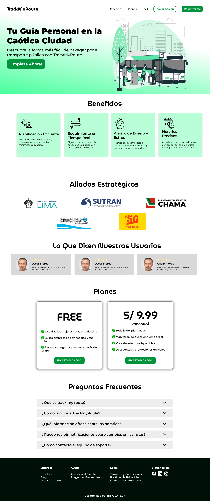
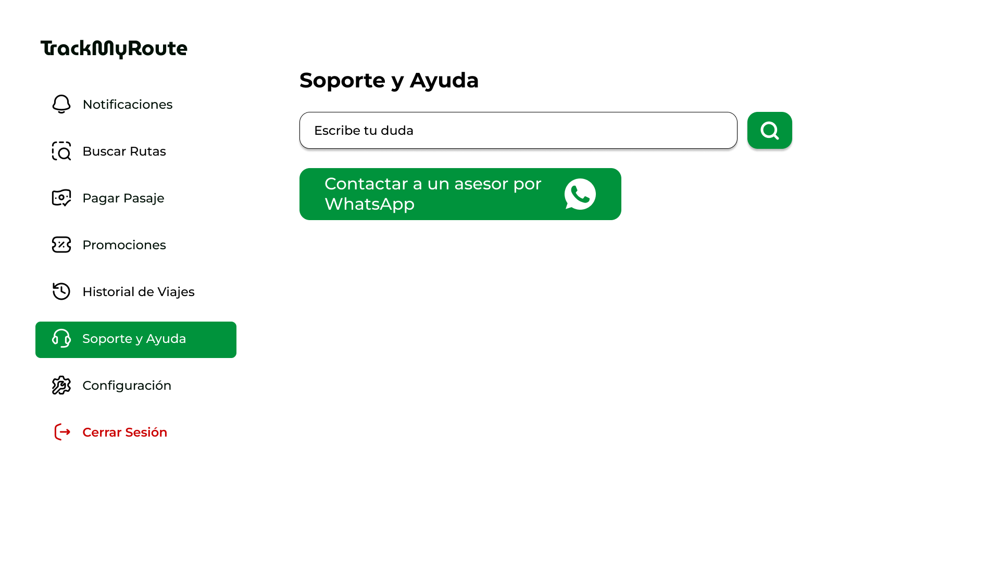

# Universidad Peruana de Ciencias Aplicadas

Ingeniería de Software

Ciclo 2024-01

# 
Desarrollo de Aplicaciones Open Source

## TB1 REPORT

**Sección:** WX54

**Profesor**: Alberto Wilmer Sanchez Seña

**StartUp Name**: InnovaTech

**Producto**: Track My Route

### Team Members:

| Member                            |    Code    |
| :-------------------------------- | :--------: |
| -      |   -         |
| Carlos Arian Ramirez Mendoza     | U202020108 |
| Javier Sharvel Irigoyen Matos     |U20221D156  |
| Eduardo Vicente Mancilla Ordaya   |U202018894  |
| Carlos Oswaldo Casimiro Fernandez |U202115412  |

 

Link al video de exposición:

**Abril del 2024**

  

# Registro de Versiones del Informe

| Versión |   Fecha    |                                                                                       Autor                                                                                        | Descripción de modificación                                                                                                                                           |
| :-----: | :--------: | :--------------------------------------------------------------------------------------------------------------------------------------------------------------------------------: | :-------------------------------------------------------------------------------------------------------------------------------------------------------------------- |
|   TB1   | 05/04/2024 | |  |

  

# Project Report Collaboration Insights

- **TB1:** Para esta entrega, realizamos como equipo las actividades correspondientes a los capítulos asignados en el siguiente repositorio dentro de nuestra organización de grupo:

    Link del repositorio del Informe Final: https://github.com/InnovaTech-Open-Source/informe/blob/main/README.md

     

    A continuación, se muestran las capturas de evidencia correspondientes al desarrollo de los siguientes capítulos:

    - Capítulo I: Introducción
    - Capítulo II: Requirements Elicitation & Analysis
    - Capítulo III: Requirements Specification
    - Capítulo IV: Product Design
    - Capítulo V: Product Implementation, Validation & Deployment

 

  

# Contenido

## Tabla de Contenidos

### [Registro de versiones del informe](#registro-de-versiones-del-informe)

### [Project Report Collaboration Insights](#project-report-collaboration-insights)

### [Contenido](#contenido)

### [Student Outcome](#student-outcome-1)

### [Capítulo I: Introducción](#capítulo-i-introducción)

- [1.1. Startup Profile](#11-startup-profile)
  - [1.1.1. Descripción de la Startup](#111-description-de-la-startup)
  - [1.1.2. Perfiles de integrantes del equipo](#112-perfiles-de-integrantes-del-equipo)
- [1.2. Solution Profile](#12-solution-profile)
  - [1.2.1 Antecedentes y problemática](#121-antecedentes-y-problemática)
  - [1.2.2 Lean UX Process](#122-lean-ux-process)
    - [1.2.2.1. Lean UX Problem Statements](#1221-lean-ux-problem-statements)
    - [1.2.2.2. Lean UX Assumptions](#1222-lean-ux-assumptions)
    - [1.2.2.3. Lean UX Hypothesis Statements](#1223-lean-ux-hypothesis-statements)
    - [1.2.2.4. Lean UX Canvas](#1224-lean-ux-canvas)
- [1.3. Segmentos objetivo](#13-segmentos-objetivo)

### [Capítulo II: Requirements Elicitation & Analysis](#capítulo-ii-requirements-elicitation--analysis)

- [2.1. Competidores](#21-competidores)
  - [2.1.1. Análisis competitivo](#211-análisis-competitivo)
  - [2.1.2. Estrategias y tácticas frente a competidores](#212-estrategias-y-tácticas-frente-a-competidores)
- [2.2. Entrevistas](#22-entrevistas)
  - [2.2.1. Diseño de entrevistas](#221-diseño-de-entrevistas)
  - [2.2.2. Registro de entrevistas](#222-registro-de-entrevistas)
  - [2.2.3. Análisis de entrevistas](#223-análisis-de-entrevistas)
- [2.3. Needfinding](#23-needfinding)
  - [2.3.1. User Personas](#231-user-personas)
  - [2.3.2. User Task Matrix](#232-user-task-matrix)
  - [2.3.3. User Journey Mapping](#233-user-journey-mapping)
  - [2.3.4. Empathy Mapping](#234-empathy-mapping)
  - [2.3.5. As-is Scenario Mapping](#235-as-is-scenario-mapping)

### [Capítulo III: Requirements Specification](#capítulo-iii-requirements-specification)

- [3.1. To-Be Scenario Mapping](#31-to-be-scenario-mapping)
- [3.2. User Stories](#32-user-stories)
- [3.3. Impact Mapping](#33-impact-mapping)
- [3.4. Product Backlog](#34-product-backlog)

### [Capítulo IV: Product Design](#capítulo-iv-product-design)

- [4.1. Style Guidelines](#41-style-guidelines)
  - [4.1.1. General Style Guidelines](#411-general-style-guidelines)
  - [4.1.2. Web Style Guidelines](#412-web-style-guidelines)
- [4.2. Information Architecture](#42-information-architecture)
  - [4.2.1. Organization Systems](#421-organization-systems)
  - [4.2.2. Labeling Systems](#422-labeling-systems)
  - [4.2.3. SEO Tags and Meta Tags](#423-seo-tags-and-meta-tags)
  - [4.2.4. Searching Systems](#424-searching-systems)
  - [4.2.5. Navigation Systems](#425-navigation-systems)
- [4.3. Landing Page UI Design](#43-landing-page-ui-design)
  - [4.3.1. Landing Page Wireframe](#431-landing-page-wireframe)
  - [4.3.2. Landing Page Mock-up](#432-landing-page-mock-up)
- [4.4. Web Applications UX/UI Design](#44-web-applications-uxui-design)
  - [4.4.1. Web Applications Wireframes](#441-web-applications-wireframes)
  - [4.4.2. Web Applications Wireflow Diagrams](#442-web-applications-wireflow-diagrams)
  - [4.4.3. Web Applications Mock-ups](#443-web-applications-mock-ups)
  - [4.4.4. Web Applications User Flow Diagrams](#444-web-applications-user-flow-diagrams)
- [4.5. Web Applications Prototyping](#45-web-applications-prototyping)
- [4.6. Domain-Driven Software Architecture](#46-domain-driven-software-architecture)
  - [4.6.1. Software Architecture Context Diagram](#461-software-architecture-context-diagram)
  - [4.6.2. Software Architecture Container Diagrams](#462-software-architecture-container-diagrams)
  - [4.6.3. Software Architecture Components Diagrams](#463-software-architecture-components-diagrams)
- [4.7. Software Object-Oriented Design](#47-software-object-oriented-design)
  - [4.7.1. Class Diagrams](#471-class-diagrams)
  - [4.7.2. Class Dictionary](#472-class-dictionary)
- [4.8. Database Design](#48-database-design)
  - [4.8.1. Database Diagram](#481-database-diagram)

### [Capítulo V: Product Implementation, Validation & Deployment](#capítulo-v-product-implementation-validation--deployment)

- [5.1. Software Configuration Management](#51-software-configuration-management)
  - [5.1.1. Software Development Environment Configuration](#511-software-development-environment-configuration)
  - [5.1.2. Source Code Management](#512-source-code-management)
  - [5.1.3. Source Code Style Guide & Conventions](#513-source-code-style-guide--conventions)
  - [5.1.4. Software Deployment Configuration](#514-software-deployment-configuration)
- [5.2. Landing Page, Services & Applications Implementation](#52-landing-page-services--applications-implementation)

    - [5.2.1. Sprint 1](#521-sprint-1)
        - [5.2.1.1. Sprint Planning 1](#5211-sprint-planning-1)
        - [5.2.1.2. Sprint Backlog 1](#5212-sprint-backlog-1)
        - [5.2.1.3. Development Evidence for Sprint Review](#5213-development-evidence-for-sprint-review)
        - [5.2.1.4. Testing Suite Evidence for Sprint Review](#5214-testing-suite-evidence-for-sprint-review)
        - [5.2.1.5. Execution Evidence for Sprint Review](#5215-execution-evidence-for-sprint-review)
        - [5.2.1.6. Services Documentation Evidence for Sprint Review](#5216-services-documentation-evidence-for-sprint-review)
        - [5.2.1.7. Software Deployment Evidence for Sprint Review](#5217-software-deployment-evidence-for-sprint-review)
        - [5.2.1.8. Team Collaboration Insights during Sprint](#5218-team-collaboration-insights-during-sprint)

### [Conclusiones](#conclusiones)

### [Bibliografía](#bibliografía)

### [Anexos](#anexos)

  

# Student Outcome

| Criterio específico                                                                                                                                                                   | Acciones realizadas

| Criterio específico                                                                                                                                                                   | Acciones realizadas                                                                                                                                                                                                                                                                                                                                                                                                                                                                                                                                                                                                                                                                                                                                                                                                                                                                                                                                                                                                                                                                                                                                                                                                                                                                              | Conclusiones                                                                                                                                                                                        |
| :------------------------------------------------------------------------------------------------------------------------------------------------------------------------------------ | :----------------------------------------------------------------------------------------------------------------------------------------------------------------------------------------------------------------------------------------------------------------------------------------------------------------------------------------------------------------------------------------------------------------------------------------------------------------------------------------------------------------------------------------------------------------------------------------------------------------------------------------------------------------------------------------------------------------------------------------------------------------------------------------------------------------------------------------------------------------------------------------------------------------------------------------------------------------------------------------------------------------------------------------------------------------------------------------------------------------------------------------------------------------------------------------------------------------------------------------------------------------------------------------------- | :-------------------------------------------------------------------------------------------------------------------------------------------------------------------------------------------------- |
| Comunica oralmente sus ideas y/o resultados con objetividad a público de diferentes especialidades y niveles jerárquicos, en el marco del desarrollo de un proyecto en ingeniería.    | TB1   Mancilla Ordaya, Eduardo Vicente  - Se hizo un análisis para poder identificar a los segmentos objetivos, y de esta manera generar soluciones innovadoras.   - Carlos Arian Ramirez Mendoza:   Se coordino en reunion con el equipo el enfoque del trabajo para tener una mejor definición, brindando cada uno nuestros puntos de vista.   - Carlos Oswaldo Casimiro Fernandez:   Se organizó una reunión con el equipo para coordinar el enfoque del trabajo, lo que permitió afinar su definición mediante la contribución de diferentes puntos de vista de todos los miembros.| TB1   Elegimos un servicio para facilitar el transporte, en el cual desarrollamos el problem statement y las hypothesis statements para dimensionar el desarrollo y solución de la problemática.| TB1   Elegimos un servicio para facilitar el transporte, en el cual desarrollamos el problem statement y las hypothesis statements para dimensionar el desarrollo y solución de la problemática.    |
| Comunica en forma escrita ideas y/o resultados con objetividad a público de diferentes especialidades y niveles jerárquicos, en el marco del desarrollo de un proyecto en ingeniería. | TB1   Mancilla Ordaya, Eduardo Vicente  - Se investigó de los principales competidores de nuestra aplicación. Además se realizaron distintos planteamientos y gráficos para tener unos segmentos objetivos principales. - Carlos Arian Ramirez Mendoza:   Se realizó el diseño de la Landing Page y Web Aplication, teniendo en cuenta los Style Guidelines para una mejor armonización de los diseños y poder dar a conocer el valor de TrackMyRoute.    - Carlos Oswaldo Casimiro Fernandez:   Se diseñaron la Landing Page y la Web Application, siguiendo las directrices de estilo para asegurar una mejor integración de los diseños y destacar el valor de la start up.| TB1   Recopilamos información necesaria para poder afrontar a los competidores directos, y de esta manera ofrecer un servicio novedoso que solucione las dificultades de los usuarios.   |

  

# Capítulo I: Introducción

## 1.1. StartUp Profile

### 1.1.1. Description de la StartUp

"TrackMyRoute" es una startup con la principal intención de transformar la forma en que las personas se desplazan por la ciudad utilizando el transporte público. Nuestra misión es simplificar y mejorar la movilidad urbana, ofreciendo a los residentes de Lima una aplicación integral que les permita encontrar las mejores rutas de transporte público para llegar a sus destinos de manera eficiente. Nuestra aplicación no solo brinda a los usuarios la capacidad de planificar sus viajes de manera óptima, sino que también proporciona información en tiempo real sobre el estado de las rutas y la disponibilidad de los medios de transporte. Además, colaboramos estrechamente con las empresas de transporte público para que también puedan beneficiarse de esta plataforma, obteniendo una visión en tiempo real de sus clientes y mejorando la calidad de sus servicios. 

### 1.1.2. Perfiles de integrantes del equipo

<table align="center"  border="1" width="70%" style="text-align:center;">
    <tr align="center">
        <td rowspan="3">
            
        </td>
        <td align="left">
            <b>Nombre y Apellido:</b>
             
            Eduardo Vicente, Mancilla Ordaya
        </td>
    </tr>
    <tr>
        <td align="left">
        <b>Carrera:</b>
         
        Ingeniería de Software
        </td>
    </tr>
    <tr>
        <td align="left">
        <b>Acerca de:</b>
         
        Soy una persona muy interesada en la programación, considero importante el trabajo en equipo ya que al colaborar se pueden idear soluciones innovadoras y efectivas a problemáticas de la vida real. Me caracterizo por tener un pensamiento analítico , y siempre busco dar distintos puntos de vista a la hora de realizar un trabajo. Estoy comprometido en seguir aprendiendo y contribuir con mi grupoo de trabajo para llevar el proyecto de la mejor manera.
        </td>
    </tr>
    <tr align="center">
        <td rowspan="3">
             
        </td>
        <td align="left">
            <b>Nombre y Apellido:</b>
             
            Carlos Oswaldo, Casimiro Fernández
        </td>
    </tr>
    <tr>
        <td align="left">
        <b>Carrera:</b>
         
        Ingeniería de Software
        </td>
    </tr>
    <tr>
        <td align="left">
        <b>Acerca de:</b>
         
       Tengo 18 años y soy estudiante de Ingeniería de Software de la Universidad Peruana de Ciencias Aplicadas. Me considero una persona proactiva, educada y sociable con los que me rodean. Además cuento con habilidades peculiares como la animación en 3d, edición de videos cinematográficos y conocimiento en lenguajes como c + +, Python.
        </td>
    </tr>
    <tr align="center">
        <td rowspan="3">
            
        </td>
        <td align="left">
            <b>Nombre y Apellido:</b>
             
            Carlos Arian Ramirez Mendoza
        </td>
    </tr>
    <tr>
        <td align="left">
        <b>Carrera:</b>
         
        Ingeniería de Software
        </td>
    </tr>
    <tr>
        <td align="left">
        <b>Acerca de:</b>
         
        Soy una persona muy interesada en la tecnología, programación y videojuegos, me gusta trabajar en equipo, planificar e idear proyectos y soluciones para problemáticas de la vida real. Me apasiona el mundo de las start-ups y cómo estas pueden lograr impactar en la vida de varias personas resolviendo sus necesidades. Me comprometo a dar ideas innovadoras y dar distintos puntos de vista a la hora de realizar un trabajo.
        </td>
    </tr>
    <tr align="center">
        <td rowspan="3">
            
        </td>
        <td align="left">
            <b>Nombre y Apellido:</b>
             
            Javier Sharvel Irigoyen Matos
        </td>
    </tr>
    <tr>
        <td align="left">
        <b>Carrera:</b>
         
        Ingeniería de Software
        </td>
    </tr>
    <tr>
        <td align="left">
        <b>Acerca de:</b>
         
        Estudié la carrera de Física en la PUCP y actualmente me encuentro en 6to ciclo en la UPC con la carrera de Ingeniería de Software. Siempre me ha interesado la ciencia y tecnología y en desarrollar aplicaciones que automaticen procesos con la ayuda de la IA. Me considero una persona optimista, responsable y autodidacta.</td>
    </tr>
    <tr align="center">
        <td rowspan="3">
            
        </td>
        <td align="left">
            <b>Nombre y Apellido:</b>
             
            OSCAR SEBASTIAN NICOLAS MORENO CARMONA
        </td>
    </tr>
    <tr>
        <td align="left">
        <b>Carrera:</b>
         
        INGENIERIA DE SOFTWARE
        </td>
    </tr>
    <tr>
        <td align="left">
        <b>Acerca de:</b>
         
        Me encuentro estudiando Ingenieria de Software desde el 2019 y considero que cada día aprendo algo nuevo. Actualmente me encuentro trabajando como programador Jr. Por otro lado, considero que utilizaré mis habilidades de programador para crear soluciones a problematicas comunes en el país. El tema de transito vehícular es un tema muy polémico en nuestra capital. Por ello, trabajaremos en grupo implementando todo lo aprendido para proponer una solución que cumpla con los estandares éticos y valores que hemos aprendido en la universidad.
        </td>
    </tr>
</table>

## 1.2. Solution Profile

En esta sección iniciaremos por un análisis de los antecedentes y problemática sobre la movilización en transporte público para identificar las raíces del problema e identificar algunas necesidades que se deban cubrir para llegar a una solución de la problemática. Asimismo, luego pasaremos por el proceso UX para poder analizar más a detalle la problemática y poder plantear una hipótesis acerca de la problemática. 

### 1.2.1. Antecedentes y problemática

La movilización en transportes públicos en Lima, se ha visto influenciada por una serie de antecedentes y problemáticas a lo largo de su historia. En un contexto de rápido crecimiento poblacional y urbano, la demanda de servicios de transporte público ha ido en constante aumento. Sin embargo, varios factores han contribuido a desafiar la eficiencia y la calidad de la movilización en la ciudad. Históricamente, Lima contaba con sistemas de transporte público, como los tranvías, en el siglo XIX. Sin embargo, la falta de inversión y una planificación inadecuada llevaron al declive y eventual desaparición de estos sistemas en la segunda mitad del siglo XX. Entre las problemáticas más apremiantes se destaca la congestión del tráfico, que afecta de manera significativa a los limeños. El aumento de vehículos particulares y la infraestructura inadecuada han resultado en largos tiempos de viaje y congestión constante en las calles de la ciudad. Asimismo, el transporte público en Lima ha enfrentado dificultades, desde deficiencias en infraestructura y falta de mantenimiento hasta servicios ineficientes. Los usuarios a menudo se ven obligados a utilizar autobuses y combis en condiciones precarias, lo que afecta negativamente su experiencia de viaje. La seguridad en el transporte público también ha sido motivo de preocupación, con incidentes de robos y acoso a los pasajeros. Esto ha generado inquietudes sobre la seguridad de los usuarios en el sistema. Además, las tarifas de transporte público pueden resultar onerosas para personas de bajos ingresos, y la falta de accesibilidad adecuada para personas con discapacidad ha sido una preocupación persistente. A pesar de estos desafíos, el gobierno y las autoridades locales han implementado medidas para mejorar el transporte público en Lima, incluyendo la introducción de sistemas de transporte masivo como el Metropolitano y el Tren Eléctrico, así como esfuerzos para combatir la informalidad y elevar la calidad del servicio. Sin embargo, los retos siguen siendo considerables en una ciudad en constante crecimiento y transformación.

¿Qué?: La movilización en transportes públicos en Lima se refiere al desplazamiento de personas dentro de la ciudad utilizando medios de transporte público, como autobuses, combis, el Metropolitano (un sistema de buses de tránsito rápido) y el Tren Eléctrico. Esto incluye viajes diarios para trabajar, estudiar y realizar actividades cotidianas.
 
¿Quién?: Los usuarios del transporte público en Lima, que incluyen a residentes locales y visitantes de la ciudad, son los principales actores de esta movilización. Además, las autoridades gubernamentales y las empresas de transporte público desempeñan un papel importante en la gestión y regulación de estos servicios. 

¿Por qué?: Las personas utilizan el transporte público en Lima por varias razones, incluyendo la congestión del tráfico, la falta de estacionamiento, la necesidad de una opción de movilidad asequible y la preocupación por el medio ambiente. Además, muchas personas no tienen acceso a un automóvil personal y dependen del transporte público para sus desplazamientos diarios. 

¿Dónde?: Esta movilización se lleva a cabo en toda la ciudad de Lima, que incluye el centro histórico, los distritos periféricos y las áreas metropolitanas circundantes. Los usuarios se desplazan tanto dentro de la ciudad como hacia y desde los suburbios. 

¿Cuándo?: La movilización en transportes públicos en Lima ocurre todos los días, durante todas las horas del día, ya que es esencial para las actividades diarias de la población. Los horarios varían según la ruta y el tipo de transporte. 

¿Cómo?: Los usuarios pueden acceder al transporte público en Lima a través de una red de paraderos y estaciones que sirven a diferentes rutas y servicios. Los sistemas de transporte masivo, como el Metropolitano y el Tren Eléctrico, ofrecen tarjetas de acceso y estaciones específicas para abordar. Los autobuses y combis tienen paraderos designados en las calles 

¿Cuánto?: El costo de utilizar el transporte público en Lima varía según el tipo de servicio y la distancia recorrida. Los precios de los boletos pueden oscilar desde unos pocos centavos hasta varios soles peruanos, dependiendo de la ruta y el sistema de transporte. Los usuarios a menudo pueden optar por tarifas con descuento si utilizan tarjetas de prepago o si son estudiantes o adultos mayores. 

Conclusiones de las 5W y 2H: En conclusión, la movilización en transportes públicos en Lima, Perú, es una parte fundamental de la vida cotidiana de sus residentes y visitantes. Este sistema de transporte es utilizado por una amplia variedad de personas que dependen de él para desplazarse por la ciudad debido a la congestión del tráfico, la falta de estacionamiento y la necesidad de opciones de movilidad asequibles. A pesar de las numerosas problemáticas, como la congestión, la seguridad y la falta de inversión en infraestructura, el transporte público sigue siendo esencial para mantener la movilidad en una ciudad en constante crecimiento y transformación. Los esfuerzos de las autoridades locales y gubernamentales, como la implementación de sistemas de transporte masivo y la regulación del sector, son pasos importantes hacia la mejora de la movilización en Lima.

### 1.2.2. Lean UX Process

#### 1.2.2.1. Lean UX Problem Statements

El propósito de TrackMyRoute es ayudar a las personas a planificar y realizar viajes en transporte público de manera fácil y eficiente. Además, de reducir los costos de transporte y la congestión de tráfico. Esto contribuye a mejorar la calidad del aire para reducir el impacto ambiental de los desplazamientos diarios.

#### 1.2.2.2. Lean UX Assumptions

User Assumptions 

I. ¿Quién es el usuario? TrackMyRoute está dirigido a cualquier persona que utilice el transporte público en la ciudad de Lima. Esto puede incluir a estudiantes, trabajadores, viajeros y cualquier otra persona que necesite planificar un viaje en transporte público. Además es útil para turistas y visitantes que no están familiarizados con el sistema de transporte público local y que necesitan ayuda para planificar sus viajes.

II. ¿Dónde encaja nuestro producto en su trabajo o vida? 

Nuestro servicio encaja para los residentes de Lima, que dependen en gran medida del transporte público para sus desplazamientos diarios, "TrackMyRoute" puede ser una herramienta esencial. Les permite encontrar la mejor ruta de transporte público para llegar a su destino de manera eficiente, ahorrando tiempo y minimizando la incertidumbre en sus viajes. Esto se traduce en una mayor comodidad y productividad en su vida cotidiana.

III. ¿Qué problemas tiene nuestro producto? ¿Evitar? 

La precisión de la información en tiempo real es fundamental para la efectividad de la aplicación. Los datos incorrectos pueden llevar a los usuarios por rutas equivocadas y generar frustración. Además, al recopilar datos de ubicación en tiempo real, es crucial garantizar la privacidad y seguridad de los usuarios. Es por ello que debemos evitar problemas de seguridad, como la exposición de datos sensibles o la posibilidad de rastreo no autorizado.

IV. ¿Cuándo y cómo es nuestro producto? ¿Usado? 

Nuestro servicio podrá ser utilizado a través de dispositivos móviles, como teléfonos inteligentes o tabletas. Los usuarios pueden descargar la aplicación desde tiendas de aplicaciones móviles, como la App Store o Google Play, e instalarla en sus dispositivos. Luego, ingresan su ubicación actual y destino, y la aplicación proporciona información sobre las rutas disponibles, tiempos de viaje estimados y actualizaciones en tiempo real sobre la ubicación de los vehículos de transporte público. Esto permite a los usuarios tomar decisiones informadas sobre la mejor manera de llegar a su destino utilizando el transporte público en Lima. 

V. ¿Qué características son importantes? 

“TrackMyRoute" es una aplicación esencial para los usuarios de transporte público en Lima, ofreciendo una amplia gama de características cruciales, como la búsqueda de rutas, información en tiempo real sobre el transporte, notificaciones y alertas, mapas interactivos, detalles de tarifas y opciones de pago, comentarios de usuarios, historial de viajes, accesibilidad y medidas de seguridad, todo ello respaldado por una colaboración efectiva con las empresas de transporte. Esta aplicación mejora la experiencia de viaje al ayudar a los usuarios a planificar y seguir sus rutas de manera eficiente, brindando un servicio completo y personalizado que facilita la movilidad en la ciudad de Lima. 

VI. ¿Cómo debe verse nuestro producto y cómo comportarse? 

Nuestra plataforma tiene que interactuar con los usuarios mediante un diseño llamativo e intuitivo con la finalidad de que nuestros usuarios confíen en nosotros y tengan facilidad de lograr sus objetivos al usar la plataforma. 

Business Assumptions 

1. Demanda de Usuarios: Suponemos que existe una demanda significativa de una aplicación de planificación de rutas de transporte público en Lima, ya que muchas personas utilizan el transporte público en la ciudad y buscan formas de optimizar sus viajes. 
2. Colaboración con Empresas de Transporte: Suponemos que las empresas de transporte público en Lima estarán dispuestas a colaborar y proporcionar datos actualizados sobre sus rutas y vehículos para integrarlos en nuestra aplicación. 

3. Disponibilidad de Datos en Tiempo Real: Suponemos que podemos acceder a datos en tiempo real de los sistemas de transporte público, lo que nos permitirá proporcionar información precisa sobre la ubicación y el estado de los vehículos. 

4. Aceptación de Tecnología: Suponemos que la población de Lima está dispuesta a adoptar y utilizar aplicaciones móviles para planificar sus viajes en transporte público, y que cuentan con los dispositivos y la conectividad necesarios. 

5. Monetización: Suponemos que podemos generar ingresos a través de modelos de monetización como la publicidad en la aplicación, la venta de boletos de transporte o la suscripción premium para características adicionales. 

6. Seguridad de Datos: Suponemos que podemos garantizar la seguridad y privacidad de los datos personales de los usuarios, lo que fomentará la confianza en nuestra aplicación. 

7. Competencia: Suponemos que habrá competidores en el mercado de aplicaciones de transporte público en Lima, y debemos encontrar formas de diferenciarnos y ofrecer un valor único a los usuarios. 

8. Retención de Usuarios: Suponemos que podemos mantener una base de usuarios activa y comprometida a largo plazo mediante actualizaciones regulares de la aplicación, características adicionales y un excelente servicio al cliente. 

9. Regulaciones y Cumplimiento Normativo: Suponemos que podemos cumplir con todas las regulaciones y requisitos legales relacionados con la operación de una aplicación de transporte público en Lima. 

10. Marketing efectivo: Suponemos que podemos llevar a cabo estrategias de marketing efectivas para aumentar la conciencia y la adopción de la aplicación entre los residentes y visitantes de Lima.

#### 1.2.2.3. Lean UX Hypothesis Statements

Creemos que existe una demanda insatisfecha de una aplicación de planificación de rutas de transporte público en Lima. 
Realizaremos encuestas y análisis de mercado para evaluar el interés y la disposición de los usuarios para utilizar la aplicación. 
Suponemos que las empresas de transporte público estarán dispuestas a colaborar y proporcionar datos esenciales para nuestra aplicación. 
Iniciaremos conversaciones con empresas de transporte para determinar su interés y disposición para colaborar.
Creemos que la población de Lima está dispuesta a utilizar aplicaciones móviles para planificar sus viajes en transporte público. 
Realizaremos encuestas de aceptación de tecnología y evaluaremos la adopción inicial de la aplicación. 
Suponemos que habrá competidores en el mercado de aplicaciones de transporte público y que podemos diferenciarnos. 
Realizaremos un análisis de la competencia y evaluaremos nuestra propuesta de valor única. 
Suponemos que podemos generar ingresos a través de modelos de monetización como la publicidad en la aplicación y la venta de boletos. 
Implementaremos estos modelos y evaluaremos la generación de ingresos y la aceptación de los usuarios.

#### 1.2.2.4. Lean UX Canvas

## 1.3. Segmentos Objetivo

Segmento objetivo 1: Pasajeros en busca de un autobús. (Pasajeros) 

• Personas que viajan al trabajo o la escuela en transporte público. 
• Turistas que exploran Lima y prefieren utilizar el transporte público. 
• Personas que no tienen acceso a un vehículo personal y dependen del transporte público para sus desplazamientos diarios. 

Segmento objetivo 2: Empresas de transporte que operan en Lima. 

• Los gerentes de operaciones y logística de estas empresas. 
• Empresas formalizadas y con papeles en regla.

# Capítulo II: Requirements Elicitation & Analysis

## 2.1. Competidores

 
Luego de realizar una investigación en el mercado, hemos encontrado tres proyectos que consideramos como potenciales competidores para TrackMyRoute. Estos son:
  

- **Moovit:**
   

  Moovit es una aplicación de movilidad urbana que proporciona a los usuarios información sobre rutas y horarios de transporte público en tiempo real. Permite a los usuarios planificar sus viajes utilizando una variedad de opciones de transporte público, incluidos autobuses, trenes, metro y tranvías. Moovit también ofrece alertas sobre interrupciones en el servicio y actualizaciones en tiempo real para ayudar a los usuarios a navegar por la ciudad de manera eficiente.
   

  

  

- **Citymapper:**
   

  Citymapper es una aplicación de planificación de viajes que ofrece rutas y horarios para una amplia gama de opciones de transporte en ciudades de todo el mundo. Además de proporcionar información sobre transporte público, Citymapper incluye opciones de transporte alternativo como bicicletas compartidas, scooters eléctricos y servicios de viaje compartido. La aplicación también ofrece detalles sobre tarifas, tiempo de viaje y opciones de rutas más rápidas o escénicas.
   

  

  

- **Trafi:**
   

  Trafi es una aplicación de movilidad urbana que ofrece información detallada sobre rutas y horarios de transporte público, así como opciones para otros modos de transporte, como bicicletas compartidas y servicios de viaje compartido. La aplicación utiliza datos en tiempo real para proporcionar a los usuarios actualizaciones sobre el estado del servicio, retrasos y cambios en las rutas. Trafi está disponible en varias ciudades de todo el mundo y se centra en ofrecer soluciones de movilidad integrales para sus usuarios.
   

  

  

### 2.1.1. Análisis competitivo

<table>
<tbody><tr><th colspan="7" valign="top"><b>Competitive Analysis Landscape</b></th></tr><tr><td colspan="2" rowspan="2">¿Por qué llevar a cabo este análisis?</td><td colspan="5">Escriba en el recuadro la pregunta que busca responder o el objetivo de este análisis.</td></tr><tr><td colspan="5">Este análisis se concretó teniendo como finalidad el poder identificar a nuestros potenciales competidores e idear estrategias y tácticas para diferenciarnos de ellos.</td></tr><tr><td colspan="3">Nuestro Producto / Competidores</td><td colspan="1" valign="top" style="font-weight: bold;">TrackMyRoute </td><td colspan="1" valign="top" style="font-weight: bold;">Moovit </td><td colspan="1" valign="top" style="font-weight: bold;">Citymapper </td><td colspan="1" valign="top" style="font-weight: bold;">Trafi </td></tr><tr><td colspan="1" rowspan="2">Perfil</td><td colspan="2">Overview</td><td colspan="1" valign="top">TrackMyRoute se destaca por su enfoque específico en mejorar la movilidad urbana en Lima, Perú. Ofrece una combinación de planificación de rutas, información en tiempo real sobre el estado del transporte público y la posibilidad de realizar pagos de pasajes dentro de la aplicación. Su colaboración con empresas de transporte público locales y la opción de una versión premium con funciones adicionales lo convierten en una opción atractiva para los residentes de Lima que buscan optimizar sus desplazamientos por la ciudad.</td><td colspan="1" valign="top">Moovit es una aplicación ampliamente reconocida a nivel mundial por su capacidad para proporcionar información detallada sobre rutas y horarios de transporte público en tiempo real. Con una amplia disponibilidad internacional, Moovit se destaca por su capacidad para ofrecer actualizaciones en tiempo real sobre el estado del servicio, alertas de servicio y una comunidad activa de usuarios que contribuyen con información valiosa sobre el transporte público en sus ciudades.</td><td colspan="1" valign="top">Citymapper es conocida por su enfoque integral en la planificación de viajes, ofreciendo opciones para una variedad de modos de transporte, incluidos el transporte público, bicicletas compartidas, scooters eléctricos y servicios de viaje compartido. Su diseño intuitivo y la capacidad de ofrecer opciones de rutas más rápidas o escénicas lo convierten en una opción popular entre los usuarios que buscan soluciones de movilidad flexibles y personalizadas en ciudades de todo el mundo.</td><td colspan="1" valign="top">Trafi ofrece una solución completa para la planificación de viajes en ciudades de todo el mundo, con información detallada sobre rutas y horarios de transporte público, así como opciones para otros modos de transporte como bicicletas compartidas y servicios de viaje compartido. Su enfoque en ofrecer soluciones de movilidad integrales y actualizaciones en tiempo real sobre el estado del servicio lo convierten en una herramienta valiosa para los usuarios que buscan optimizar sus desplazamientos urbanos.</td></tr><tr><td colspan="2">Ventaja competitiva</td><td colspan="1" valign="top">TrackMyRoute se destaca por su enfoque localizado en Lima, Perú, lo que permite una adaptación precisa a las necesidades del sistema de transporte público local. Además, su integración con las empresas de transporte público ofrece una experiencia más confiable y personalizada para los usuarios, brindando acceso a datos actualizados y recursos exclusivos.</td><td colspan="1" valign="top">Moovit sobresale por su amplia disponibilidad internacional, convirtiéndose en una opción confiable para usuarios que viajan entre diferentes ciudades y países. Además, sus actualizaciones en tiempo real sobre el estado del servicio y la participación activa de la comunidad de usuarios garantizan información precisa y confiable para optimizar los viajes en transporte público.</td><td colspan="1" valign="top">Citymapper ofrece una ventaja competitiva a través de su variedad de modos de transporte, que incluyen opciones como transporte público, bicicletas compartidas y servicios de viaje compartido. Su diseño intuitivo y las opciones de rutas personalizadas hacen que la planificación de viajes sea flexible y adaptada a las preferencias individuales de los usuarios.</td><td colspan="1" valign="top">Trafi destaca por ofrecer soluciones integrales de movilidad, proporcionando información detallada sobre una amplia variedad de modos de transporte. Sus actualizaciones en tiempo real sobre el estado del servicio permiten a los usuarios tomar decisiones informadas sobre sus desplazamientos, adaptándose a cualquier cambio en el transporte público de manera eficiente.</td></tr><tr><td colspan="1" rowspan="2">Perfil de Marketing</td><td colspan="2">Mercado objetivo</td><td colspan="1" valign="top">El mercado objetivo principal para TrackMyRoute son los residentes de Lima, Perú, que dependen del transporte público para sus desplazamientos diarios. Esto incluye a estudiantes, trabajadores y cualquier persona que utilice el transporte público en la ciudad. Además, la aplicación también puede ser útil para turistas y visitantes que desean explorar Lima utilizando el transporte público.</td><td colspan="1" valign="top">Moovit tiene un mercado objetivo amplio y diverso que abarca usuarios de transporte público en ciudades de todo el mundo. Esto incluye a personas de todas las edades y grupos demográficos que utilizan el transporte público como parte de su rutina diaria, así como viajeros y turistas que buscan orientación sobre el transporte público en nuevas ubicaciones.</td><td colspan="1" valign="top">Citymapper se dirige a usuarios urbanos en ciudades de todo el mundo que buscan una solución integral para planificar sus viajes utilizando una variedad de modos de transporte. Esto incluye a personas jóvenes y activas que prefieren opciones de movilidad flexibles y personalizadas, así como a profesionales y trabajadores que necesitan optimizar sus desplazamientos diarios.</td><td colspan="1" valign="top">Trafi está dirigido a usuarios urbanos en ciudades de todo el mundo que buscan una solución completa para planificar y optimizar sus viajes utilizando diferentes modos de transporte. Su mercado objetivo incluye a personas de todas las edades y grupos demográficos que dependen del transporte público y están interesadas en recibir información actualizada y precisa sobre sus opciones de movilidad.</td></tr><tr><td colspan="2">Estrategias de marketing</td><td colspan="1" valign="top">Publicidad dirigida en redes sociales, enfocada en residentes de Lima y colaboración con empresas de transporte público para promoción mutua.</td><td colspan="1" valign="top">Publicidad en plataformas online y apps de viajes. Tambien programas de referidos para usuarios existentes.</td><td colspan="1" valign="top">Creación de contenido educativo en video. Colaboraciones con influencers locales.</td><td colspan="1" valign="top">Optimización SEO para mejorar visibilidad en búsquedas. Participación en eventos de movilidad urbana.</td></tr><tr><td colspan="1" rowspan="3">Perfil de Producto</td><td colspan="2">Productos &amp; Servicios</td><td colspan="1" valign="top">TrackMyRoute ofrece una aplicación móvil para la planificación de rutas de transporte público en Lima, con una versión premium que incluye características como pagos integrados y actualizaciones en tiempo real. Además, se colabora con empresas de transporte público para mejorar la calidad de los servicios y la experiencia del usuario.</td><td colspan="1" valign="top">Moovit proporciona una aplicación móvil para la planificación de rutas y horarios de transporte público a nivel global. Ofrece actualizaciones en tiempo real sobre el estado del servicio y alertas de servicio, junto con una comunidad activa de usuarios que contribuyen con información sobre el transporte público.</td><td colspan="1" valign="top">Citymapper ofrece una aplicación móvil para la planificación de viajes integrales en ciudades de todo el mundo. La aplicación proporciona rutas para una variedad de modos de transporte y opciones de rutas personalizadas, con un diseño intuitivo para mejorar la experiencia del usuario.</td><td colspan="1" valign="top">Trafi es una aplicación móvil que permite la planificación de viajes en ciudades globales. Ofrece información detallada sobre rutas y horarios de transporte público, así como opciones para otros modos de transporte. Además, proporciona actualizaciones en tiempo real sobre el estado del servicio y soluciones integrales de movilidad para usuarios urbanos.</td></tr><tr><td colspan="2">Precios &amp; Costos</td><td colspan="1" valign="top">Ofrece una versión gratuita con opciones básicas y una versión premium con características adicionales que los usuarios pueden adquirir mediante una tarifa mensual o anual. Los ingresos provienen de la venta de la versión premium y los costos asociados incluyen desarrollo inicial, mantenimiento de servidores, actualizaciones de software y posibles costos de soporte técnico.</td><td colspan="1" valign="top">La aplicación es gratuita para los usuarios, generando ingresos principalmente a través de acuerdos de publicidad y posiblemente asociaciones con empresas de transporte público. Los costos incluyen el desarrollo continuo de la aplicación, mantenimiento de servidores y posibles costos de soporte técnico y marketing.</td><td colspan="1" valign="top">Es gratuita para los usuarios y probablemente genere ingresos a través de acuerdos de publicidad y posibles asociaciones con empresas de transporte. Los costos están asociados con el desarrollo y mantenimiento continuo de la aplicación, así como los gastos de servidores y posibles costos de marketing.</td><td colspan="1" valign="top">Igualmente gratuita para los usuarios, Trafi podría generar ingresos a través de acuerdos de publicidad y posiblemente asociaciones con empresas de transporte. Los costos incluyen el desarrollo y mantenimiento de la aplicación, así como los gastos de servidores y posibles costos de marketing y soporte técnico.</td></tr><tr><td colspan="2">Canales de distribución (Web y/o Móvil)</td><td colspan="1" valign="top">La aplicación puede distribuirse a través de su propio sitio web, donde los usuarios pueden acceder a información sobre la aplicación y descargarla desde enlaces directos a las tiendas de aplicaciones.</td><td colspan="1" valign="top">Moovit ofrece información sobre la aplicación y enlaces de descarga en su sitio web oficial, permitiendo a los usuarios acceder y descargar la aplicación desde sus navegadores web.</td><td colspan="1" valign="top">Citymapper proporciona información sobre la aplicación y enlaces de descarga en su sitio web oficial, permitiendo a los usuarios acceder y descargar la aplicación desde sus navegadores web.</td><td colspan="1" valign="top">Trafi ofrece información sobre la aplicación y enlaces de descarga en su sitio web oficial, permitiendo a los usuarios acceder y descargar la aplicación desde sus navegadores web.</td><tr></tr><td colspan="1" rowspan="5">Análisis SWOT</td></td></tr><tr><td colspan="2">Fortalezas</td><td colspan="1" valign="top">Enfoque localizado en Lima, integración con empresas de transporte público, versión premium con funciones adicionales.</td><td colspan="1" valign="top">Amplia disponibilidad internacional, actualizaciones en tiempo real, comunidad activa de usuarios.</td><td colspan="1" valign="top">Variedad de modos de transporte, diseño intuitivo, opciones de rutas personalizadas.</td><td colspan="1" valign="top">Soluciones integrales de movilidad, actualizaciones en tiempo real, enfoque en la experiencia del usuario.</td></tr><tr><td colspan="2">Debilidades</td><td colspan="1" valign="top">Dependencia del desarrollo del sistema de transporte público en Lima, competencia con aplicaciones establecidas.</td><td colspan="1" valign="top">Dependencia de la calidad de los datos de transporte público, competencia con otras aplicaciones similares.</td><td colspan="1" valign="top">Dependencia de la calidad de los datos de transporte, competencia con aplicaciones establecidas como Moovit.</td><td colspan="1" valign="top">Dependencia de la calidad de los datos de transporte público, competencia con aplicaciones más establecidas como Moovit y Citymapper.</td></tr><tr><td colspan="2">Oportunidades</td><td colspan="1" valign="top">Crecimiento del mercado de aplicaciones de movilidad urbana en Lima, colaboración con más empresas de transporte público, expansión a otras ciudades.</td><td colspan="1" valign="top">Expansión a nuevos mercados, desarrollo de nuevas características y funcionalidades, colaboraciones con más empresas de transporte.</td><td colspan="1" valign="top">Expansión a nuevas ciudades, desarrollo de nuevas características innovadoras, colaboraciones con empresas de transporte y urbanismo.</td><td colspan="1" valign="top">Expansión a nuevos mercados globales, desarrollo de nuevas funciones para mejorar la experiencia del usuario, colaboraciones con empresas de transporte y gobierno.</td></tr><tr><td colspan="2">Amenazas</td><td colspan="1" valign="top">Cambios en la infraestructura de transporte, entrada de competidores locales o globales.</td><td colspan="1" valign="top">Entrada de nuevos competidores, cambios en las políticas de datos de transporte público.</td><td colspan="1" valign="top">Cambios en la infraestructura de transporte, entrada de nuevos competidores con características similares.</td><td colspan="1" valign="top"> Cambios en las políticas de transporte, entrada de nuevos competidores con enfoques similares.</td></tr></tbody></table>

### 2.1.2. Estrategias y tácticas frente a competidores

1. **Diferenciación de Producto:**

Estrategia: TrackMyRoute se enfocará en resaltar las características únicas de la aplicación, como la integración con empresas de transporte público locales y la oferta de una versión premium con funciones exclusivas.
      
Tácticas: Para llevar a cabo esta estrategia, se implementarán campañas de marketing que destaquen estas características distintivas, utilizando mensajes claros y persuasivos para comunicar el valor añadido de la aplicación en comparación con los competidores.

2. **Desarrollo Continuo:**

Estrategia: La startup se comprometerá a mantenerse actualizada con las últimas tendencias y tecnologías en el mercado de movilidad urbana.
      
Tácticas: Para lograr esto, se planificarán actualizaciones frecuentes de la aplicación para mejorar la experiencia del usuario, se agregarán nuevas características basadas en comentarios de usuarios y análisis de competidores, y se buscarán colaboraciones con empresas de transporte público para integrar nuevas funcionalidades.

3. **Colaboraciones Estratégicas:**

Estrategia: Se buscarán asociaciones con empresas de transporte público y otras organizaciones relacionadas con la movilidad urbana.
      
Tácticas: Para implementar esta estrategia, la startup identificará oportunidades para colaborar con empresas de transporte público en la mejora de la infraestructura de datos, ofrecerá promociones y descuentos exclusivos para los usuarios de la aplicación en colaboración con estas empresas, y participará activamente en eventos y conferencias de la industria para establecer conexiones con otras organizaciones del sector.

4. **Enfoque en la Experiencia del Usuario:**

Estrategia: La prioridad será la satisfacción del usuario y la facilidad de uso de la aplicación.
      
Tácticas: Para llevar a cabo esta estrategia, se realizarán pruebas de usuario para identificar áreas de mejora en la experiencia del usuario, se ofrecerá soporte técnico receptivo y eficiente, y se proporcionarán recursos educativos y tutoriales para ayudar a los usuarios a aprovechar al máximo la aplicación.

5. **Análisis Competitivo Continuo:**

Estrategia: La startup se comprometerá a monitorear de cerca las acciones y estrategias de los competidores.
      
Tácticas: Para ejecutar esta estrategia, se realizarán análisis periódicos de la competencia para identificar nuevas oportunidades y amenazas, se seguirán de cerca las actualizaciones y lanzamientos de productos de los competidores, y se ajustará la estrategia de la startup en función de los cambios en el mercado competitivo.

## 2.2. Entrevistas

### 2.2.1. Diseño de entrevistas

En esta sección se han definido una cierta cantidad de preguntas para nuestros segmentos objetivos. Esta información se usará en el desarrollo de nuestra solución.

**Adquisición de información general**

**Segmento 1: Usuarios Diarios de Transporte Público en Lima:**

1. ¿Cómo te llamas?
2. ¿Cuántos años tienes?
3. ¿Cuál es tu ocupación?
4. ¿Qué tan a menudo utilizas el transporte público en Lima para tus desplazamientos diarios?
5. ¿Qué aspectos consideras más importantes al planificar tus viajes en transporte público?
6. ¿En qué distrito resides?
7. ¿Tienes algún dispositivo de preferencia para acceder a aplicaciones móviles?
8. ¿Qué canales digitales utilizas con mayor frecuencia para interactuar con información relacionada con el transporte público?
9. ¿Cuáles son tus principales objetivos al utilizar el transporte público en Lima y cuáles son las frustraciones más comunes que experimentas?
10. ¿Qué aplicaciones o herramientas utilizas actualmente para planificar tus viajes en transporte público?
11. ¿Qué características te gustaría ver en una aplicación de planificación de rutas de transporte público?
12. ¿Estarías dispuesto a pagar por una versión premium de una aplicación que ofreciera características adicionales para mejorar tu experiencia de viaje en transporte público?
13. ¿Cuáles son las funcionalidades más importantes que consideras al elegir una aplicación de transporte público?
14. ¿Qué aspectos valoras más en términos de usabilidad y diseño de la aplicación?
15. ¿Cómo prefieres recibir información en la aplicación: a través de notificaciones push, mensajes de texto, correos electrónicos, u otros medios?
16. ¿Qué opiniones o comentarios tienes sobre aplicaciones similares que has utilizado previamente?

**Segmento 2: Empresas de transporte en Lima:**

1. ¿Cuál es el nombre de su empresa de transporte público?
2. ¿Cuál es su rol dentro de la empresa?
3. ¿Podría describir brevemente las principales operaciones y servicios de transporte que ofrece su empresa en Lima?
4. ¿Qué desafíos enfrenta actualmente su empresa en términos de operaciones de transporte y atención al cliente?
5. ¿Está su empresa utilizando alguna aplicación o plataforma tecnológica para gestionar sus servicios de transporte?
6. ¿Qué características o funcionalidades consideraría más útiles en una aplicación destinada a empresas de transporte público como la suya?
7. ¿Cómo cree que una aplicación de este tipo podría mejorar la eficiencia y la calidad de los servicios de transporte que ofrece su empresa?
8. ¿Qué aspectos consideraría más importantes al evaluar y seleccionar una aplicación para su empresa?
9. ¿Cuál sería su principal preocupación o requisito al considerar la adopción de una nueva aplicación o plataforma tecnológica para su empresa de transporte público?
10. ¿Tiene alguna experiencia previa en la implementación o uso de aplicaciones similares en su empresa o en la industria del transporte público en general?

### 2.2.2. Registro de entrevistas

**Segmento: Usuarios Diarios de Transporte Público en Lima**

**Segmento: Empresas de transporte en Lima**

**Entrevista 01**

Entrevistado 1:

Nombre y apellidos: Steffi Villena

Edad: 26 años

Ubicación: Lima

Evidencia de la reunión:

Inicio: 00:04

Fin: 06:10

**Enlace de entrevista:** https://upcedupe-my.sharepoint.com/:v:/g/personal/u202018894_upc_edu_pe/EYU8NwblMmBBvE4TaX4v4zEBwo00tBBZ3yhPmLo6KmRXyA?e=pnhTL1

**Resumen de la entrevista:**
Nuestra entrevistada fue Steffi Villena, que a través de contactos familiares trabaja en una empresa de transportes en el area de Contabilidad, sus primeras impresiones son un poco desalentadoras hacia nuestra idea pero aún así llegamos a la conclusión que este usuario daría el intento de usar nuestra idea de aplicación, opina que ha probado diversas aplicaciones pero no con mucho exito ya que no le llamaron mucho la atención.

### 2.2.3. Análisis de entrevistas

## 2.3. Needfinding

### 2.3.1. User Personas

Los User Personas son necesarios para la formación de este proyecto, ya que brindan una perspectiva completa de los usuarios clave. Estos perfiles detallados permiten a la startup diseñar una plataforma y experiencia enfocada y personalizada, abordando de manera efectiva los desafíos específicos de cada segmento objetivo:

**User Persona del segmento: Usuarios Diarios de Transporte Público en Lima**

  

**User Persona del segmento: Empresas de transporte en Lima**

  

 

### 2.3.2. User Task Matrix

En esta seccion, se describen las tareas típicas que realizan los dos segmentos objetivos. Se evalúa la frecuencia y la severidad de cada tarea de los user persona, lo que ayuda a priorizar y entender cuáles son las áreas clave en las que el producto podría influir.

**Segmento Objetivo:** Usuarios Diarios de Transporte Público en Lima

|                               Tarea                               |  Frecuencia  | Severidad |
| :---------------------------------------------------------------: | :----------: | :-------: |
|          Planificar viajes diarios        | Casi siempre |   Alta    |
|               Obtener información sobre transporte público            | Casi siempre |   Alta     |
|         Minimizar tiempo de viaje        |  Casi siempre    |   Alta    |
|              Evitar retrasos en el transporte público             |   Casi siempre  |   Alta    |
|  Acceder a noticias locales  | A veces |   Media   |
|    Buscar eventos locales   |   A veces    |   Media   |
|          Acceder a descuentos locales         |   A veces    |   Media   |
| Utilizar transporte público en horarios no laborales  |   Rara vez    |   Baja    |
| Interactuar con la aplicación |   Casi siempre    |   Alta   |

**Segmento Objetivo:** Empresas de transporte en Lima

| Tareas                                                               | Frecuencia   | Severidad |
| -------------------------------------------------------------------- | ------------ | --------- |
| Registrar la empresa en la aplicación            | Una vez | Alta      |
| Configurar y personalizar la aplicación | Rara vez | Alta     |
| Programar rutas y horarios de los vehículos                | Casi Siempre  | Alta      |
| Supervisar el estado y la ubicación de los vehículos        | Casi siempre     | Alta      |
| Comunicarse con los conductores en tiempo real           | Casi siempre     | Alta      |
| Generar informes de rendimiento y eficiencia  | Rara vez | Alta    |
| Integrar la aplicación con sistemas de pago     | Rara vez     | Alta    |
| Proporcionar retroalimentación sobre la aplicación     | Rara vez      | Media    |
| Monitorear la satisfacción del cliente y gestionar quejas | Casi siempre     | Media   |

### 2.3.3. User Journey Mapping

**User Journey Mapping del segmento: Usuarios Diarios de Transporte Público en Lima**

  

**User Journey Mapping del segmento: Empresas de transporte en Lima**

  

### 2.3.4. Empathy Mapping

  

### 2.3.5. As-is Scenario Mapping

As-is Map del Usuario

  

 

As-is Map de la Empresa

  

# Capítulo III: Requeriments Specifications

## 3.1 To-Be Scenario Mapping

Con la herramiento del To-be scenario mapping exploramos las mejoras y las nuevas funcionalidades que se incorporarán en la aplicación “TrackMyRoute”. Estas mejoras están diseñadas para optimizar la experiencia de los usuarios al movilizarse por la ciudad de Lima en transporte público y proporcionar a la empresa de transporte una visión en tiempo real de sus clientes. A través de este proceso, visualizamos cómo la aplicación evolucionará para brindar un servicio más eficiente y útil a los dos grupos de usuarios.

  

 

## 3.2 User Stories

En la sección de User Stories, detallaremos las diversas necesidades y requerimientos de nuestros
usuarios y la empresa de transporte. Cada historia de usuario representará un escenario o una función
específica que se espera que la aplicación proporcione, con el objetivo de cumplir connuestro 
propósito principal: ayudar a las personas a navegar por la ciudad de Lima utilizando el transporte 
público de manera eficiente y brindar a la empresa de transporte información en tiempo real sobre sus 
clientes. A través de estas historias de usuario, podremos comprender mejor cómo la aplicación 
satisfará las necesidades de ambas partes y proporcionará una solución integral para la movilidad
urbana.

| **Epic / Story ID** | **Título**                                      | **Descripción**                                                                                                                                                                                                    | **Criterios de Aceptación**                                                                                                                                                                                                                                                                                                                                                                                                                                                          | **Relacionado con (Epic ID)** |
|---------------------|-------------------------------------------------|--------------------------------------------------------------------------------------------------------------------------------------------------------------------------------------------------------------------|--------------------------------------------------------------------------------------------------------------------------------------------------------------------------------------------------------------------------------------------------------------------------------------------------------------------------------------------------------------------------------------------------------------------------------------------------------------------------------------|-------------------------------|
| HU01                | Registrar al usuario                            | Como cliente quiero registrarme con todos mis datos pertinentes (nombre, correo, edad, etc.) en la aplicación para poder hacer uso de sus funcionalidades.                                                         | Escenario: El cliente se registra en la aplicación. Dado que el cliente se encuentra en la pantalla de inicio de sesión,Y el cliente quiere registrarse para usar la aplicación,Cuando el cliente rellena un formulario de creación de una cuenta nueva con todos sus datos personales pertinentes,Entonces el sistema guardará todos sus datos y le permitirá acceder a las funcionalidades de la aplicación.                                                                       | HU02                          |
| HU02                | Inicio de sesión en la aplicación               | Como cliente quiero iniciar sesión en la aplicación con mis credenciales (correo y contraseña) para poder entrar a la aplicación con mi cuenta existente                                                           | Escenario: El cliente quiere iniciar sesión en la aplicación Dado que el cliente se encuentra en la pantalla de inicio de sesión,Y el usuario ya tiene una cuenta existente,Cuando el cliente rellena los campos de la pantalla de inicio de sesión con sus credenciales (correo y contraseña) correctamente,Entonces el cliente podrá acceder a las funcionalidades de la aplicación con su cuenta existente.                                                                       | HU01                          |
| HU03                | Eliminar cuenta o usuario                       | Como cliente quiero tener la posibilidad de borrar mi cuenta para que mis datos ya no permanezcan en la base de datos de la aplicación.                                                                            | Escenario: El cliente quiere eliminar una cuenta o usuario Dado que el cliente se encuentra en la pantalla de ajustes de la cuenta,Y el cliente tiene la intención de borrar su cuenta,Cuando el cliente selecciona la opción de borrar su cuenta en la aplicación,Entonces la aplicación eliminará su cuenta y los datos personales del cliente de la base de datos.                                                                                                                | HU01,HU02                     |
| HU04                | Registro de rutas y buses                       | Como desarrollador quiero registrar a las rutas de transporte urbano y a los buses que transitan por estas para así tener un registro de todas las que se encuentren en Lima.                                      | Escenario: el desarrollador quiere registrar las rutas de los buses. Dado que el desarrollador se encuentra en la pantalla de ingreso de datos en la base de datos,Y el desarrollador tiene a la mano los datos de las rutas y los buses,Cuando el desarrollador quiera insertar los datos pertinentes,Entonces la aplicación guardará en la base de datos todos los datos relacionados con las rutas y los buses                                                                    | HU05, HU06                    |
| HU05                | Registro de conductores                         | Como desarrollador quiero registrar a los conductores de los buses para así tener un registro de todos los conductores que transitan por las rutas por motivos de seguridad al usuario.                            | Escenario: El desarrollador quiere registrar a los conductores de los buses. Dado que el desarrollador se encuentra en la pantalla de ingreso de datos en la base de datos,Y el desarrollador tiene a la mano los datos de las rutas y los buses,Cuando el desarrollador quiera insertar los datos pertinentes,Entonces la aplicación guardará en la base de datos todos los datos relacionados con las rutas y los buses.                                                           | HU04, HU06                    |
| HU06                | Registro de las empresas operadoras de rutas    | Como desarrollador quiero registrar a las empresas que operan en cada una de las rutas de transporte urbano en buses para así tener un registro de todas estas empresas en la base de datos de la aplicación       | Escenario: El desarrollador quiere registrar a las empresas operadoras de rutas. Dado que el desarrollador se encuentra en la pantalla de ingreso de datos en la base de datos,Y el desarrollador tiene a la mano los datos de las empresas operadoras de las rutas de transporte de buses,Cuando el desarrollador quiera insertar los datos pertinentes, Entonces la aplicación guardará en la base de datos todos los datos relacionados con las empresas operadoras de las rutas. | HU04, HU05                    |
| HU07                | Implementación de servicios externos            | Como desarrollador quiero implementar servicios externos de otras empresas como Google Maps para así poder darle la funcionalidad deseada a la aplicación sin tener que desarrollar todo desde cero                | Escenario: El desarrollador quiere implementar servicios externos a la app.Dado que el desarrollador se encuentra en la pantalla de implementación de servicios externos,Y el desarrollador ha juntado el código y los requisitos necesarios para llamar al servicio externo,Cuando el desarrollador quiera crear una funcionalidad que llame a un servicio externo de otra empresa,Entonces la aplicación hará uso de este servicio cuando lo requiera.                             | HU06                          |
| HU08                | Visualización del menú de opciones              | Como cliente quiero ver el menú de opciones de la aplicación para así tener una idea de las funcionalidades que están presentes en esta.                                                                           | Escenario: El cliente quiere ver las funciones de la aplicación.Dado que el cliente se encuentra en la pantalla de inicio de la aplicación,Y el cliente quiere ver qué puede ser la aplicación,Cuando el cliente selecciona el botón que abre el menú de opciones,Entonces la aplicación deberá mostrarle al usuario el menú de opciones con todas las funcionalidades presentes.                                                                                                    | HU10                          |
| HU09                | Configuración de búsqueda de ruta personalizada | Como cliente quiero modificar ciertas opciones relacionadas a la búsqueda de rutas (tiempo de viaje, distancia al paradero, mostrar la ruta más rápida, etc.) para optimizar esta búsqueda según mis preferencias. | Escenario: El cliente quiere realizar una búsqueda personalizada.Dado que el cliente se encuentra en la pantalla de búsqueda de rutas,Y el cliente quiere especificar las condiciones de búsqueda según su parecer,Cuando el cliente modifique los criterios de búsqueda,Entonces la aplicación le mostrará las rutas disponibles según los filtros de búsqueda establecidos por el usuario.                                                                                         | HU10                          |
| HU10 | Visualización del mapa                        | Como cliente quiero ver un mapa interactivo con las rutas presentes para tener una idea más clara del posible camino por el que quiera viajar.                                                                                                      | Escenario: El cliente quiere ver el mapa. Dado que el cliente se encuentra en la pantalla principal, Y el cliente desea visualizar el mapa  con las rutas disponibles, Cuando el cliente seleccione la opción  de buscar rutas e ingrese todos los filtros que desee, Entonces la aplicación deberá mostrar  un mapa interactivo de la zona con las posibles rutas.                                                                                                                                                   | HU12       |
| HU11 | Visualización de costos del pasaje            | Como cliente quiero ver el costo del pasaje aproximado al elegir una ruta en la aplicación para saber con anticipación cuánto dinero debo tener para costear el viaje                                                                               | Escenario: El cliente quiere ver los costos de pasaje. Dado que el cliente se encuentra en la pantalla principal, Y el cliente desea ver cuánto le costaría realizar un viaje por cierta ruta, Cuando el cliente haya seleccionado  la opción de buscar rutas y haya  realizado la búsqueda de las rutas  disponibles, Entonces la aplicación deberá mostrar el costo aproximado de cada viaje por ruta.                                                                                                              | HU12       |
| HU12 | Visualización del número de buses a abordar   | Como cliente quiero ver cuántos buses se tiene que abordar para llegar al destino para determinar qué ruta sería la mejor conforme a la situación en la que me encuentre.                                                                           | Escenario: El cliente quiere ver cuántos buses puede abordar Dado que el cliente se encuentra en la pantalla principal, Y el cliente desea saber cuántos buses debe abordar para llegar a cierto lugar, Cuando el cliente haya seleccionado la opción de buscar rutas y haya realizado la búsqueda de las rutas disponibles, Entonces la aplicación deberá mostrar la cantidad de buses que se deberá abordar para llegar al destino.                                                                                 | HU14       |
| HU13 | Planificación de viajes                       | Como cliente quiero planificar mis viajes en función a mi ubicación actual y al destino (se muestran los horarios de salida y de llegada de los buses, su ubicación, etc.) para organizar mejor mis tiempos.                                        | Escenario: El cliente quiere planificar un viaje Dado que el cliente se encuentra en la pantalla principal, Y el cliente desea planificar un viaje, Cuando el cliente haya seleccionado la opción de buscar rutas y haya realizado la búsqueda de las rutas disponibles, Entonces la aplicación deberá permitirle al cliente el planificar su viaje dependiendo de los tiempos estimados del viaje hipotético.                                                                                                        | HU15       |
| HU14 | Información en tiempo real                    | Como cliente quiero observar la información pertinente a mi viaje en tiempo real (ubicación actual de los autobuses, su hora estimada de llegada y cualquier retraso o cambio en la ruta) para tomar mejores decisiones en el acto.                 | Escenario: El cliente quiere ver información de los buses en tiempo real Dado que el cliente ya eligió la ruta en la que desea viajar, Y el cliente desea ver información pertinente a su viaje en tiempo real, Cuando el cliente seleccione la opción para ver la información en tiempo real, Entonces la aplicación le tendrá que mostrar al cliente toda la información relacionada a su viaje actualizada y en tiempo real.                                                                                       | HU17       |
| HU15 | Compra de boletos                             | Como cliente quiero comprar boletos para el transporte público directamente desde la aplicación para agilizar y facilitar el proceso de pago por los boletos o pasajes.                                                                             | Escenario: El cliente quiere comprar un boleto anticipadamente Dado que el cliente ya eligió la ruta en la que desea viajar, Y los buses en los cuales el cliente va a viajar tienen el pago de pasajes por la aplicación disponible, Cuando el cliente le de a la opción para pagar por la aplicación, Entonces la aplicación le permitirá al cliente pagar por el boleto o pasaje desde esta.                                                                                                                       | HU13       |
| HU16 | Notificaciones personalizadas                 | Como cliente quiero recibir notificaciones personalizadas acerca de eventos pertinentes a mi viaje en bus (retrasos, horarios, etc.) para estar al tanto de las situaciones que pueden afectar mi futuro viaje                                      | Escenario: El cliente quiere recibir notificaciones acerca de eventos de buses Dado que el cliente está al tanto de las notificaciones de su celular, Cuando ocurra un evento de importancia para el viaje del cliente, Entonces la aplicación emitirá una notificación, la cual el cliente puede ver o ignorar si es que lo considera necesario.                                                                                                                                                                     | HU14       |
| HU17 | Mapas interactivos                            | Como cliente quiero visualizar mapas interactivos en los que pueda ver la ubicación de las paradas de autobús, la ruta y la ubicación de los autobuses en tiempo real, para así poder tomar mejores decisiones en el momento sobre qué ruta elegir. | Escenario: El cliente quiere visualizar mapas interactivos Dado que el cliente se encuentra en la pantalla principal, Y el cliente desea visualizar el mapa con las rutas disponibles, Cuando el cliente seleccione la opción de buscar rutas e ingrese todos los filtros que desee, Entonces la aplicación deberá mostrar un mapa interactivo de la zona donde se puede ver la ubicación de las paradas de autobús, la ruta y la ubicación de los autobuses en tiempo real.                                          | HU10, HU14 |
| HU18 | Integración con otros servicios de transporte | Como desarrollador quiero integrar la aplicación con otros servicios de transporte público, como trenes o tranvías, para permitir a los usuarios planificar viajes intermodales.                                                                    | Escenario: El desarrollador quiere implementar otros servicios de transporte Dado que el desarrollador se encuentra en la pantalla de implementación de servicios externos, Y el desarrollador ha juntado el código y los requisitos necesarios para incluir a otro servicio de transporte público, Cuando el desarrollador quiera crear una funcionalidad que se integre con otro servicio, Entonces la aplicación hará uso de esta función para permitirles a los clientes la planificación de viajes intermodales. | HU04       |
| HU19 | Accesibilidad                                 | Como desarrollador quiero hacer la aplicación más accesible para personas con discapacidades, ofreciendo opciones de accesibilidad como la navegación por voz y el alto contraste, para ampliar la cantidad de posibles usuarios.                   | Escenario: El desarrollador quiere hacer la aplicación más accesible para el usuario Dado que el desarrollador se encuentra en la pantalla de implementación de servicios de accesibilidad, Y el desarrollador ha juntado el código y los requisitos necesarios para hacer uso de herramientas de accesibilidad, Cuando el desarrollador quiera crear una funcionalidad que mejore la accesibilidad de la aplicación, Entonces la aplicación integrará esta funcionalidad.                                            | HU20       |
| HU20 | Retroalimentación de los usuarios             | Como cliente quiero dar una retroalimentación sobre mi experiencia de viaje o al utilizar la aplicación para dar a conocer mi agrado o mi malestar con respecto al funcionamiento de esta.                                                          | Escenario: El cliente quiere dar una retroalimentación sobre la app. Dado que el cliente está en la pantalla principal de la aplicación, Y el cliente desee dar una retroalimentación sobre su experiencia, Cuando el cliente seleccione la opción para dar una retroalimentación, Entonces la aplicación le deberá dar la posibilidad al cliente de dar una retroalimentación tanto sobre su viaje en el bus, la ruta o la funcionalidad de la aplicación en general.                                                | HU19       |
| HU21 | integración de api de transporte público         | como desarrollador, quiero integrar una api de transporte público para acceder a datos actualizados sobre rutas, horarios y paradas de transporte público en tiempo real.                               | dado que se ha establecido la conexión con la api de transporte público, cuando realizo una solicitud de búsqueda de rutas con una ubicación de origen y destino, entonces la aplicación devuelve datos precisos y actualizados sobre las rutas disponibles, horarios de salida y llegada, y paradas intermedias.                             | HU12, HU14 |
| HU22 | implementación de sistema de autenticación oauth | como desarrollador, quiero implementar un sistema de autenticación oauth para permitir que los usuarios inicien sesión utilizando sus cuentas de redes sociales.                                        | dado que un usuario intenta iniciar sesión en la aplicación utilizando oauth, cuando selecciona la opción de inicio de sesión con una plataforma de redes sociales, entonces la aplicación redirige al usuario al sitio web de la plataforma de redes sociales para autorizar el acceso.                                                      | HU01, HU02 |
| HU23 | desarrollo de algoritmo de ruta óptima           | como desarrollador, quiero diseñar un algoritmo eficiente para calcular la ruta óptima entre dos puntos dados, teniendo en cuenta factores como la distancia, el tiempo y las preferencias del usuario. | dado que un usuario solicita una búsqueda de ruta entre dos ubicaciones, cuando el algoritmo calcula la ruta óptima basada en las preferencias del usuario y los datos de transporte disponibles, entonces la aplicación devuelve la ruta más rápida y eficiente, considerando factores como la duración del viaje y el número de trasbordos. | HU13       |
| HU24 | sección principal de landing page                | como visitante de la landing page, quiero ser recibido por una sección principal llamativa para captar mi atención y despertar mi interés en explorar más sobre la aplicación de seguimiento de rutas.  | dado que ingreso a la landing page, cuando miro la sección principal, entonces encuentro un diseño visualmente atractivo con un mensaje claro y conciso que destaque las características únicas de la aplicación.                                                                                                                             |            |
| HU25 | información de beneficios                        | como visitante de la landing page, quiero encontrar una sección dedicada a los beneficios de la aplicación de seguimiento de rutas para comprender cómo puede mejorar mi experiencia de viaje.          | dado que estoy interesado en la aplicación, cuando navego por la sección de beneficios, entonces encuentro información clara y convincente sobre cómo la aplicación puede ayudarme a planificar mejor mis viajes, ahorrar tiempo y optimizar mis desplazamientos diarios.                                                                     |            |
| HU26 | conocer los aliados que respaldan la app         | como visitante de la landing page, quiero ver una lista de aliados que respaldan la aplicación de seguimiento de rutas para sentir confianza en su calidad y fiabilidad.                                | dado que estoy interesado en la aplicación, cuando reviso la sección de aliados, entonces encuentro logotipos o testimonios de empresas, organizaciones o autoridades que respaldan y confían en la aplicación.                                                                                                                               |            |
| HU27 | reseñas de usuarios satisfechos                  | como visitante de la landing page, quiero encontrar reseñas y testimonios de usuarios satisfechos para obtener una idea de su experiencia y satisfacción con la aplicación.                             | dado que estoy interesado en la aplicación, cuando busco la sección de reseñas, entonces encuentro testimonios reales de usuarios que describen cómo la aplicación ha mejorado su experiencia de viaje y les ha ayudado en sus desplazamientos diarios.                                                                                       |            |
| HU28 | conocer los planes de suscripción                | como visitante de la landing page, quiero encontrar información sobre los planes de suscripción disponibles para entender las opciones de pago y beneficios asociados con cada plan.                    | dado que estoy interesado en utilizar la aplicación de forma regular, cuando navego por la sección de planes de suscripción, entonces encuentro una descripción clara de los diferentes planes disponibles, sus precios y las características incluidas en cada uno.                                                                          |            |
| HU29 | obtener respuestas a preguntas frecuentes        | como visitante de la landing page, quiero acceder a una sección de preguntas frecuentes para encontrar respuestas a mis dudas más comunes sobre la aplicación de seguimiento de rutas.                  | dado que tengo preguntas sobre la aplicación, cuando accedo a la sección de preguntas frecuentes, entonces encuentro una lista completa de preguntas comunes y sus respuestas claras y concisas, lo que me ayuda a entender mejor cómo funciona la aplicación y cómo puedo utilizarla eficazmente.                                            |            |

## 3.3 Impact Mapping

En la sección de Impact Mapping, exploraremos las repercusiones más amplias y los objetivos 
estratégicos que buscamos lograr con la implementación de esta aplicación. En lugar de centrarnos en 
detalles técnicos o funcionalidades específicas, el Impact Mapping nos ayudará a comprender cómo 
nuestro proyecto contribuirá a alcanzar metas más grandes y cómo afectará positivamente a los 
diferentes grupos de interés. A través de este mapeo de impacto, identificaremos las conexiones entre 
las características de la aplicación y los resultados deseados, lo que nos permitirá tomar decisiones 
informadas sobre qué aspectos priorizar y cómo medir el éxito a largo plazo.

  

## 3.4 Product Backlog

|#Orden|User Story ID|Título|Descripción|Story Points|
|:----|:----|:----|:----|:----|
|1|HU07|Implementación de servicios externos|Como desarrollador quiero implementar servicios externos de otras empresas como Google Maps para así poder darle la funcionalidad deseada a la aplicación sin tener que desarrollar todo desde cero|5|
|2|HU09|Configuración de búsqueda de ruta personalizada|Como cliente quiero modificar ciertas opciones relacionadas a la búsqueda de rutas (tiempo de viaje, distancia al paradero, mostrar la ruta más rápida, etc.) para optimizar esta búsqueda según mis preferencias.|5|
|3|HU10|Visualización del mapa|Como cliente quiero ver un mapa interactivo con las rutas presentes para tener una idea más clara del posible camino por el que quiera viajar.|5|
|4|HU11|Visualización de costos del pasaje|Como cliente quiero ver el costo del pasaje aproximado al elegir una ruta en la aplicación para saber con anticipación cuánto dinero debo tener para costear el viaje|5|
|5|HU12|Visualización del número de buses a abordar|Como cliente quiero ver cuántos buses se tiene que abordar para llegar al destino para determinar qué ruta sería la mejor conforme a la situación en la que me encuentre.|5|
|6|HU13|Planificación de viajes|Como cliente quiero planificar mis viajes en función a mi ubicación actual y al destino (se muestran los horarios de salida y de llegada de los buses, su ubicación, etc.) para organizar mejor mis tiempos.|5|
|7|HU14|Información en tiempo real|Como cliente quiero observar la información pertinente a mi viaje en tiempo real (ubicación actual de los autobuses, su hora estimada de llegada y cualquier retraso o cambio en la ruta) para tomar mejores decisiones en el acto.|5|
|8|HU15|Compra de boletos|Como cliente quiero comprar boletos para el transporte público directamente desde la aplicación para agilizar y facilitar el proceso de pago por los boletos o pasajes.|5|
|9|HU17|Mapas interactivos|Como cliente quiero visualizar mapas interactivos en los que pueda ver la ubicación de las paradas de autobús, la ruta y la ubicación de los autobuses en tiempo real, para así poder tomar mejores decisiones en el momento sobre qué ruta elegir.|5|
|10|HU18|Integración con otros servicios de transporte|Como desarrollador quiero integrar la aplicación con otros servicios de transporte público, como trenes o tranvías, para permitir a los usuarios planificar viajes intermodales.|5|
|11|HU21|integración de api de transporte público|como desarrollador, quiero integrar una api de transporte público para acceder a datos actualizados sobre rutas, horarios y paradas de transporte público en tiempo real.|5|
|12|HU23|desarrollo de algoritmo de ruta óptima|como desarrollador, quiero diseñar un algoritmo eficiente para calcular la ruta óptima entre dos puntos dados, teniendo en cuenta factores como la distancia, el tiempo y las preferencias del usuario.|5|
|13|HU04|Registro de rutas y buses|Como desarrollador quiero registrar a las rutas de transporte urbano y a los buses que transitan por estas para así tener un registro de todas las que se encuentren en Lima.|3|
|14|HU05|Registro de conductores|Como desarrollador quiero registrar a los conductores de los buses para así tener un registro de todos los conductores que transitan por las rutas por motivos de seguridad al usuario.|3|
|15|HU06|Registro de las empresas operadoras de rutas|Como desarrollador quiero registrar a las empresas que operan en cada una de las rutas de transporte urbano en buses para así tener un registro de todas estas empresas en la base de datos de la aplicación|3|
|16|HU08|Visualización del menú de opciones|Como cliente quiero ver el menú de opciones de la aplicación para así tener una idea de las funcionalidades que están presentes en esta.|3|
|17|HU19|Accesibilidad|Como desarrollador quiero hacer la aplicación más accesible para personas con discapacidades, ofreciendo opciones de accesibilidad como la navegación por voz y el alto contraste, para ampliar la cantidad de posibles usuarios.|3|
|18|HU20|Retroalimentación de los usuarios|Como cliente quiero dar una retroalimentación sobre mi experiencia de viaje o al utilizar la aplicación para dar a conocer mi agrado o mi malestar con respecto al funcionamiento de esta.|3|
|19|HU22|implementación de sistema de autenticación oauth|como desarrollador, quiero implementar un sistema de autenticación oauth para permitir que los usuarios inicien sesión utilizando sus cuentas de redes sociales.|3|
|20|HU24|sección principal de landing page|como visitante de la landing page, quiero ser recibido por una sección principal llamativa para captar mi atención y despertar mi interés en explorar más sobre la aplicación de seguimiento de rutas.|3|
|21|HU25|información de beneficios|como visitante de la landing page, quiero encontrar una sección dedicada a los beneficios de la aplicación de seguimiento de rutas para comprender cómo puede mejorar mi experiencia de viaje.|3|
|22|HU26|conocer los aliados que respaldan la app|como visitante de la landing page, quiero ver una lista de aliados que respaldan la aplicación de seguimiento de rutas para sentir confianza en su calidad y fiabilidad.|3|
|23|HU27|reseñas de usuarios satisfechos|como visitante de la landing page, quiero encontrar reseñas y testimonios de usuarios satisfechos para obtener una idea de su experiencia y satisfacción con la aplicación.|3|
|24|HU28|conocer los planes de suscripción|como visitante de la landing page, quiero encontrar información sobre los planes de suscripción disponibles para entender las opciones de pago y beneficios asociados con cada plan.|3|
|25|HU29|obtener respuestas a preguntas frecuentes|como visitante de la landing page, quiero acceder a una sección de preguntas frecuentes para encontrar respuestas a mis dudas más comunes sobre la aplicación de seguimiento de rutas.|3|
|26|HU01|Registrar al usuario|Como cliente quiero registrarme con todos mis datos pertinentes (nombre, correo, edad, etc.) en la aplicación para poder hacer uso de sus funcionalidades.|2|
|27|HU02|Inicio de sesión en la aplicación|Como cliente quiero iniciar sesión en la aplicación con mis credenciales (correo y contraseña) para poder entrar a la aplicación con mi cuenta existente|2|
|28|HU03|Eliminar cuenta o usuario|Como cliente quiero tener la posibilidad de borrar mi cuenta para que mis datos ya no permanezcan en la base de datos de la aplicación.|2|
|29|HU16|Notificaciones personalizadas|Como cliente quiero recibir notificaciones personalizadas acerca de eventos pertinentes a mi viaje en bus (retrasos, horarios, etc.) para estar al tanto de las situaciones que pueden afectar mi futuro viaje|2|

# Capítulo IV: Product Design

## 4.1. Style Guidelines.
Las guías de estilo serán los conjuntos de reglas y recomendaciones que se establecieron para estandarizar la presentación, estilo y accesibilidad de la Landing Page y Web Application.
### 4.1.1. General Style Guidelines.
La paleta de colores que estamos usando en nuestra Landing Page y Web Application son los siguientes:
div

  

El color principal y base de nuestra solución es el verde y sus distintas tonalidades, ya que con este color buscamos provocar en nuestros usuarios equilibrio, seguridad y tranquilidad. Buscamos la simplicidad y minimalismo para que nuestros usuarios no se sientan abrumados.

Las fuentes elegidas para la Landing Page y Web Application son MuseoModerno para el logo, títulos y subtitulos ya que la tipografía simula pistas y carreteras lo cual vemos que encaja con nuestro producto, y Montserrat para los textos, contenido informativo y botones de Landing Page. 

  

Decidimos que el letter spacing será 1,15 para textos y contenido de la página y 2px para título y subtítulos para una visualización óptima de nuestros usuarios.

El tono de nuestra comunicación será casual, respetuoso y sereno ya que nuestro público será en su mayoría adultos.

### 4.1.2. Web Style Guidelines

Para el diseño de la Web Application establecemos los colores predominantes verde y blanco y la tipografía Montserrat en el 90% del diseño. Se tuvo en cuenta la simplicidad en el diseño y que sea óptimo para ejecutarse eficientemente en todos los tipos de dispositivos respetando los principios responsive y de usabilidad.

También utilizamos iconos para la parte del dashboard.

  

## 4.2. Information Architecture.
En esta sección mostraremos el proceso de organizar, estructurar y etiquetar el contenido de la Landing Page y Web Application de Track My Route de manera que sea fácil de entender y usar para nuestros usuarios. Nos centramos en el diseño de la estructura y la navegación de sistemas de información, como sitios web, sistemas de gestión de contenido, entre otros, con el objetivo de mejorar la usabilidad y la experiencia del usuario.

### 4.2.1. Organization Systems.
* **Forma jerarquica (visual hierarchy)**
	
La aplicación web de TrackMyRoute estará organizada jerarquicamente en un dashboard principal que ofrece acceso rápido a las funciones principales, incluyendo la búsqueda de rutas por ubicación y horarios en tiempo real y el pago de pasajes. En segunda instancia los usuarios podrán acceder a su historial de viajes y pagos y promociones que se brindan a los usuarios. En un último nivel de jerarquía los usuarios podrán configurar notificaciones personalizadas y gestionar su perfil de usuario, mientras que una sección de ayuda proporcionará recursos adicionales y soporte. La estructura jerárquica garantiza una navegación intuitiva y una experiencia de usuario fluida en la búsqueda y gestión de información relacionada con el transporte público.

* **Organización secuencial (step-by-step to accomplish)**
	
La organización secuencial se aplicó en la aplicación web de TrackMyRoute en situaciones donde los usuarios necesiten completar una serie de pasos en un orden específico para lograr un objetivo. Por ejemplo, durante el proceso de registro de un nuevo usuario, se pueden guiar a través de una secuencia de pasos que incluya la creación de una cuenta, la configuración de preferencias y la aceptación de los términos y condiciones, también lo podemos ver al momento de buscar rutas y buses y al pagar pasaje por medio de la aplicación. De esta manera, la organización secuencial ayuda a simplificar y estructurar procesos complejos, facilitando la navegación y la comprensión para los usuarios.

* **Organización matricial**

La organización matricial se aplicó en TrackMyRoute en situaciones donde existe una variedad de categorías o dimensiones que se superponen y se relacionan entre sí. Por ejemplo lo podemos visualizar al momento de buscar buses donde se nos muestra un mapa y la información de los buses, así como filtros que podemos utilizar. También lo podemos ver en la organización visual de las promociones que se les dan a los usuarios.

### 4.2.2. Labeling Systems.
Para facilitar el entendimiento de la aplicación para los usuarios hemos utilizado el siguiente sistema de etiquetado.

| Etiqueta            | Descripción                                                                                                                                    |   
|:-------------------:|:----------------------------------------------------------------------------------------------------------------------------------------------:|
| Buscar Rutas        | En esta sección se le mostrará al usuario avisos por parte de la aplicación                                                                    |  
| Notificaciones      | En esta sección el usuario podrá ingresar su origen y destino y visualizar sus rutas y buses, así como un mapa con información en tiempo real. |  
| Pagar Pasaje        | En esta sección el usuario podrá pagar sus pasajes de su ruta de manera anticipada para ser más eficiente a la hora de abordar el bus.         |   
| Promociones         | En esta sección el usuario podrá acceder a distintas promociones que brindamos a nuestros usuarios premium                                     |   
| Historial de Viajes | En esta sección el usuario podrá visualizar sus viajes anteriores y pasajes pagados.                                                           | 
| Soporte y Ayuda     | En esta sección el usuario accede a ayuda por parte de nuestro equipo de soporte.                                                              |  
| Configuración       | En esta sección el usuario puede configurar sus preferencias y su perfil.                                                                      |  

### 4.2.3. SEO Tags and Meta Tags

Los SEO tags y Meta tags son importantes porque juegan un papel fundamental en la optimización de motores de búsqueda (SEO) y en la mejora de la visibilidad y el ranking de una página web en los resultados de búsqueda. Por lo cual para optimizar la búsqueda y posicionamiento de TrackMyRoute hemos establecido lo siguiente:
	
* **Landing Page:**
	Title: TrackMyRoute
  Description: Optimiza tu viaje y libérate del estrés
  Keywords: Autobús, Metro, Tren, Paradas, Ubicación, Tráfico, Planificador, Seguridad, Comodidad, Precisión, Horario, Buses en Lima, Rutas.
  Authors: InnovaTech

* **Web Application:**
  Title:  TrackMyRoute
  Description: Optimiza tu viaje y libérate del estrés
  Keywords: Autobús, Metro, Tren, Paradas, Ubicación, Tráfico, Planificador, Seguridad, Comodidad, Precisión, Horario, Buses en Lima, Rutas, Buses, Seguimiento, Mapas, Transporte, Navegación, Tiempo, Notificaciones, Promociones, Pasajes, Historial.
  Authors: InnovaTech

### 4.2.4. Searching Systems.

El sistema de búsqueda en nuestra aplicación se basa en los buses y sus rutas o los paraderos en los que estos recogen pasajeros. Este sistema estará enlazada a una base de datos de buses y rutas, así como el costo de los pasajes. Por lo cual este sistema de búsqueda se visualizará en los apartados de “Buscar Rutas”, “Pagar Pasajes” y “Historial de Viajes”.

### 4.2.5. Navigation Systems.

Los sistemas de navegación implementados en TrackMyRoute son los siguientes:

Barra de navegación en la Landing Page: El usuario podrá movilizarse a través de nuestra Landing Page conociendo nuestra aplicación y propuesta de valor.
Barra de navegación en Web Application: El usuario podrá conocer los diferentes apartados y funcionalidades de nuestra propuesta.
Tarjetas de promociones: El usuario podrá visualizar las promociones que le ofrecemos.

## 4.3. Landing Page UI Design.

### 4.3.1. Landing Page Wireframe.

  

### 4.3.2. Landing Page Mock-up.

  

## 4.4. Web Applications UX/UI Design.

### 4.4.1. Web Applications Wireframes.

  

  

  

  

  

  

  

  

### 4.4.2. Web Applications Wireflow Diagrams.

  

  

### 4.4.3. Web Applications Mock-ups.

  

  

  

  

  

  

  

  

  

  

  

### 4.4.4. Web Applications User Flow Diagrams.

  

  

### 4.5. Web Applications Prototyping.

  

Link del Prototipo en Figma: https://www.figma.com/proto/pGDbVEFRTenVTPa6xzySjQ/TrackMyRoute-OpenSource?type=design&node-id=3-6&t=Tc3cgQGdxXchceg5-1&scaling=scale-down-width&page-id=1%3A3&starting-point-node-id=3%3A6&mode=design

## 4.6. Domain-Driven Software Architecture.

### 4.6.1. Software Architecture Context Diagram.

### 4.6.2. Software Architecture Container Diagrams.

### 4.6.3. Software Architecture Components Diagrams.

## 4.7. Software Object-Oriented Design.

### 4.7.1. Class Diagrams.

### 4.7.2. Class Dictionary.

## 4.8. Database Design.

### 4.8.1. Database Diagram.

# Capítulo V: Product Implementation, Validation & Deployment

## 5.1. Software Configuration Management.

### 5.1.1. Software Development Environment Configuration.

**Requirements Management**

1. Trello: Es una herramienta utilizada para gestionar el flujo de trabajo de proyectos principalmente basados en marcos detrabajos ágiles. Será empleado para visualizar y actualizar el estado actual de las tareas e historias de usuariopertenecientes al sprint a desarrollar. Ruta de referencia https://trello.com/es
2. Google docs: Google Docs es una suite de aplicaciones de procesamiento de texto, hojas de cálculo y presentaciones en línea. Aunque no es específicamente una herramienta de gestión de requisitos, se puede utilizar para documentar y colaborar en la definición y seguimiento de requisitos de proyectos. docs.google.com
	
**Product UX/UI Design**

1. Figma: Plataforma de elaboración de prototipos y edición gráfica, principalmente utilizado para el diseño digital. En elcaso del proyecto, será utilizado para el prototipado de la aplicación y sus versiones de Desktop y Mobile Web Browser.Ruta de referencia https://www.figma.com
2. UXPressia: UXPressia es una herramienta especializada en la creación de mapas de experiencia de usuario, perfiles de clientes y otros elementos relacionados con el diseño de UX. Ayuda a visualizar y comprender la experiencia del usuario en un producto o servicio. https://uxpressia.com

**Software Testing**

1. Gherkin:  El lenguaje Gherkin es un lenguaje de dominio específico utilizado para escribir pruebas de aceptación en un formato legible por humanos. Se utiliza junto con herramientas de prueba de comportamiento, como Cucumber, para automatizar pruebas funcionales. https://cucumber.io/docs/gherkin/

**Software Development**

1. WebStorm: Entorno de desarrollo integrado elegido para la elaboración y compilación del código por motivos dedominio por parte de los integrantes del equipo de trabajo. Utilizar este IDE supone de valor para el desarrollo del proyecto puesto que incluye la posibilidad de agregar extensiones de utilidad, soporte de edición de texto en múltipleslenguajes de programación, disponibilidades en múltiples sistemas operativos, entre otros beneficios. Ruta de referencia https://www.jetbrains.com/webstorm/
2. HTML5: HyperText Markup Language, o por sus siglas HTML, es un lenguaje de etiquetado para páginas web. Seráempleado en el desarrollo del proyecto para la presentación del contenido en la aplicación. Ruta de referencia https://www.w3schools.com/html/html5_syntax.asp
3. CSS: Cascading Style Sheets es un lenguaje que maneja el diseño y presentación de las páginas web, el cual va de la manocon HTML. Ruta de referencia https://google.github.io/styleguide/htmlcssguide.html
4. JavaScript: Es un lenguaje de programación interpretado y orientado a objetos. Se utilizará para elaborar la interfaz deusuario dentro de la aplicación. Ruta de referencia https://developer.mozilla.org/es/docs/Web/JavaScript
5. Angular: Angular es un framework de desarrollo de aplicaciones web de código abierto y basado en TypeScript, mantenido por Google y una comunidad de desarrolladores. Es utilizado para crear aplicaciones web de una sola página (SPA) y aplicaciones web dinámicas. Angular proporciona un conjunto de herramientas y bibliotecas que simplifican el desarrollo de aplicaciones web complejas al seguir el patrón de arquitectura Modelo-Vista-Controlador (MVC) y ofrecer funcionalidades como enlace de datos bidireccional, inyección de dependencias, rutas, formularios reactivos, animaciones y mucho más https://angular.io/

**Software Deployment**

1. Git: Herramienta de control de versiones que permite registrar y gestionar las diferentes versiones del programa. Seutilizará para mantener un historial de cambios y simplificar la corrección de errores. Los miembros del equipo accederána través de la línea de comandos en sus sistemas locales. Ruta de referencia https://git-scm.com/

**Software Documentation and Project Management**

1. Github: GitHub es una plataforma de desarrollo colaborativo que utiliza el sistema de control de versiones Git. Se utiliza para alojar, revisar y colaborar en proyectos de desarrollo de software, lo que facilita la colaboración entre desarrolladores. Ruta de referencia https://github.com/

### 5.1.2. Source Code Management.

Para mantener el orden al desarrollar una solución y evitar conflictos o superposiciones de información, los proyectos se trabajaron en un organización de GitHub y dentro de esta se encuentran los diferentes repositorios para cada proyecto cuyos enlaces de los repositorios son los siguientes:

**Liks del repositorio de GitHub**:

- Link de la organización: https://github.com/InnovaTech-Open-Source
- Link de la landing page: https://github.com/InnovaTech-Open-Source/TrackMyRoute_Landing
- Link del informe: https://github.com/InnovaTech-Open-Source/informe
- Link del front end: https://github.com/InnovaTech-Open-Source/track-my-route
- Link del back end: https://github.com/InnovaTech-Open-Source/backend-track-my-route

Estrucutra de las ramas:

- **Main Branch:** Esta rama es la principal de la aplicación. Donde se encontrarán las versiones más estables del desarrollo. Solo se admiten cambios que hayan sido probados en otras ramas.
- **Develop Branch:** Esta rama es donde se realizarán los avances del proyecto y desarollo.
- **Feature Branch:** Esta rama es donde se implementarán nuevas características de la aplicación, para luego ser enviada a la rama de desarrollo.
- **Release Branch:** Esta rama es una instancia de la rama Develop, para posteriormente ser enviada a la rama Main.
- **Hotfix Branch:** Estas ramas son creadas con la finalidad de corregir errores puntuales que puedan estar perjudicando al usuario en su experiencia de uso de la aplicación.

### 5.1.3. Source Code Style Guide & Conventions.

**HTML**: Unas de las prácticas que hemos seguido para alcanzar un código limpio, conciso, coherente, legible y escalable son las siguientes:

- Se usan elementos HTML que tengan un significado claro y preciso para el contenido que se está marcando. Por ejemplo, utiliza header, nav, main, article, section, aside, footer, entre otros, para estructurar la landing page de forma semántica.
- Aunque HTML5 permite algunas etiquetas sin cierre (como "img" y "input"), utilizamos la buena práctica de cerrar todas las etiquetas correctamente para evitar problemas de renderizado. Por ejemplo: `
 Código claro y legible.
`
- Para mejorar la accesibilidad, siempre incluye el atributo alt en las etiquetas "img" para describir brevemente el contenido de la imagen. Por ejemplo: ``
- HTML permite combinar mayúsculas y minúsculas en los nombres de los elementos y atributos, pero limitamos dar
  al uso de solo minúsculas para preservar el orden y asegurar la legibilidad del código.
- No omitir las etiquetas `<html>`, `<body>` y `<header>`.
- Escribir en una línea los comentarios cortos.

**CSS**: Entre las prácticas se mencionan:

- Los nombres de clases son intuitivos, legibles y autodescriptivos.
- Separar las declaraciones y selectores en nuevas líneas para agilizar la legibilidad.
- Usar comentarios para explicar el código.
- Aplicar sangría a todo el contenido de un bloque.

**JavaScript**: Principales prácticas aplicadas:

- Uso de camelCase para nombrar variables y funciones. Por ejemplo, `myVariable` y `myFunction`.
- Uso de PascalCase para nombrar clases y constructores.Por ejemplo, `myClass`.
- Evitar el uso de nombres de variables genéricos o ambiguos.
- Uso general de comentarios para explicar el propósito y funcionalidad de la porción del código.
- Uso de punto y coma al final de cada declaración.
- Uso de comillas simples ('') o comillas dobles ("") de forma consistente para las cadenas de texto.
- Organización del código en bloques lógicos separados por líneas en blanco para mejorar la legibilidad.
- Uso de el operador ternario `(condición ? resultadoTrue : resultadoFalse)` de manera adecuada y legible.
- Evitar el uso de funciones obsoletas o en desuso.
- Uso de try-catch para manejar y gestionar errores de manera adecuada.

**Gherking Language:** Lenguaje de dominio específico utilizado en Behavior Driven Development (BDD), se enfoca en facilitar la comunicación entre los equipos de negocios y técnicos al abordar los problemas concretos. Para mejorar la legibilidad y la organización de nuestrosd escenarios, se emplean saltos de línea y palabras clave como "Given", "When", "Then" y "And". Estas prácticas nos ayudan a estructurar de manera clara y efectiva los diferentes tipos de escenarios en BDD.

### 5.1.4. Software Deployment Configuration.

 
  Para la implementación de la aplicación Track My Route, se utilizará la plataforma de Github Pages y Github Actions para la implementación y despliegue de la aplicación. 
  Donde en cada cambio que se realice en nuestra rama pricipal (main), se desplegará automáticamente en la plataforma de Github Pages.

- Paso uno: Asegurarnos de que el repositorio de GitHub contenga todos los archivos necesarios para el sitio web.

- Paso dos: Ir a la configuración del repositorio en GitHub y habilitar GitHub Pages, seleccionando la rama principal (main) y la carpeta desde la que se desea publicar el sitio web.
  

- Paso tres: Verificar que se haya desplegado correctamente en la plataforma de Github Pages.
  
  
## 5.2. Landing Page, Services & Applications Implementation.

### 5.2.1. Sprint 1

#### 5.2.1.1. Sprint Planning 1.

| Sprint 1                         | Implementación de funcionalidades y diseño de la aplicación.                                                                                    |
| -------------------------------- | ----------------------------------------------------------------------------------------------------------------------------------------------- |
| Sprint Planning Background       |
| Date                             | 06/04/2024                                                                                                                                      |
| Time                             | 17:00 horas                                                                                                                                          |
| Location                         | Reunión realizada mediante Google Meet                                                                                                              |
| Prepared By                      | Mancilla Ordaya, Eduardo Vicente                                                                                                               |
| Attendees (to planning meeting) | Ramirez Mendoza, Carlos Arian/Casimiro Fernandez, Carlos Oswaldo /Mancilla Ordaya, Eduardo Vicente/Irigoyen Matos, Javier Sharvel/Moreno Carmona, Oscar Sebastian |
| Sprint n - 1 Review              | Se creará la organización de InnovaTech en Github y el repositorio de la organización. Además, se implementará el single page landing page.    |
| Sprint n – 1 Retrospective       | La implementación para el landing se ha realizado mediante html y css. |
| **Sprint Goal & User Stories**   |
| Sprint 1 Goal                    | Realizar y desplegar el Landing Page                                                                                                            |
| Sprint 1 Velocity                | 5                                                                                                                                              |
| Sum of Story Points              | 21                                                                                                                                              |

#### 5.2.1.2. Sprint Backlog 1.

|**Sprint #**|**Sprint 1**| | | | | | |
|:----|:----|:----|:----|:----|:----|:----|:----|
|**User Story**| |**Task**| | | | | |
|id|Title|Id|Title|Description|Estimations(Hours)|Assigned To|Status(To-do /InProcess/ToReview/Done)|
|HU24|Sección principal de landing page|T001|Desarrollo de Header|Desarrollo e implementación de los estilos que corresponden al encabezado (Header).|3|Oscar Sebastian|Done|
|HU25|Información de beneficios|T002|Desarrollo de Footer|Desarrollo e implementación de los estilos que corresponden a la sección de beneficios de la app|2|Carlos Arian|To-do|
|HU26|Conocer los aliados que respaldan la app|T003|Desarrollo de sección de aliados de la app.|Desarrollo e implementación de los estilos que corresponden a la seccion de aliados de la app con HTML/CSS/JS|3|Oscar Sebastian|Done|
|HU27|Reseñas de usuarios satisfechos|T004|Desarrollo de sección de reseñas de usuarios de la app|Desarrollo e implementación de los estilos que corresponden a la seccion reseñas con HTML/CSS/JS|2|Javier Sharveln|Done|
|HU28|Conocer los planes de suscripción|T005|Desarrollo de sección de planes de suscripción|Desarrollo e implementación de los estilos que corresponden a la seccion de los planes de suscripción con HTML/CSS/JS|3|Carlos Arian|Done|
|HU29|Obtener respuestas a preguntas frecuentes|T006|Desarrollo de sección de preguntas frecuentes|Desarrollo e implementación de los estilos que corresponden a la seccion de preguntas frecuentes con HTML/CSS/JS|3|Carlos Oswaldo|InProcess|
|HU30|Diseño responsive de Landing Page.|T007|Desarrollo responsive de la Landing Page|Implementación de prácticas y elementos responsive para la adaptabilidad de la Landing Page para diferentes dispositivos.|3|Eduardo Mancilla|Done|

  

Link del trello: https://trello.com/invite/b/ESztreG7/ATTI1648e8bd36893d9f82781c102fa68cbcF5A8F07E/sprint-1

#### 5.2.1.3. Development Evidence for Sprint Review.

| Repository   | Branch                                      | Commit Id | Commit Message                   | Commit Message Body | Commited on (Date) |
| ------------ | ------------------------------------------- | --------- | -------------------------------- | ------------------- | ------------------ |
| TrackMyRoute_Landing | feature/PlansSection (then develop) | cb7812d   | feat: Plans Section | -                   | 12/04/2024         |
|TrackMyRoute_Landing | feature/seccion-preguntasfrecuentes                    | 29f75eb  | feature: Preguntas Frecuentes      | -                   | 12/04/2024         |

#### 5.2.1.4. Testing Suite Evidence for Sprint Review.

Para esta entrega, no se implementó el conjunto de apartados relacionados con Web Services, ya que el desarrollo se hizo en base al Landing Page.

### 5.2.1.5. Execution Evidence for Sprint Review.

### 5.2.1.6. Services Documentation Evidence for Sprint Review.

En este sprint en particular, no hemos utilizado servicios web, ya que nos hemos concentrado exclusivamente en la creación de la página de inicio estática. Por lo tanto, en esta presentación no se proporciona documentación relacionada con la utilización de servicios web.

### 5.2.1.7. Software Deployment Evidence for Sprint Review.

Para realizar el despliegue automático de nuestra Landing Page, utilizamos la herramienta Github Pages, el cual permite generar páginas web desde un repositorio público dentro del cual se aloja el código con el que se implementa la página. 

El link de nuestra Landing Page es el siguiente: https://innovatech-open-source.github.io/TrackMyRoute_Landing/

### 5.2.1.8. Team Collaboration Insights during Sprint.

## Conclusiones

**TB1:**

- Mediante el análisis de competidores, hemos obtenido una visión clara de nuestras fortalezas y debilidades, lo que nos permite ofrecer un producto que se adapte de manera precisa a las necesidades de nuestros usuarios. Este proceso nos ha brindado una ventaja competitiva al identificar oportunidades para mejorar y destacar en el mercado.  

- Para el desarrollo de nuestra aplicación, hemos empleado una amplia gama de herramientas, como user personas, empathy maps, user journey maps, análisis as-is y to-be, product backlog, así como la creación de diagramas y diseños de base de datos, entre otras. Esta exhaustiva metodología de trabajo garantiza que nuestra aplicación esté diseñada de manera óptima y alineada con las expectativas de nuestros usuarios.  

- Las entrevistas con los usuarios desempeñaron un papel fundamental en nuestra investigación. Estas conversaciones directas nos proporcionaron una comprensión profunda de las verdaderas necesidades de nuestros usuarios, lo que nos permitió abordarlas de manera efectiva a través de nuestra propuesta. Las voces de los usuarios han sido el motor impulsor de nuestro proceso de desarrollo.  

- La primera entrega del proyecto no solo nos permitió presentar soluciones iniciales, sino que también nos brindó la oportunidad de explorar diversas alternativas para abordar nuestra problemática. Fue un momento de reflexión en el que buscamos satisfacer las necesidades de nuestros segmentos objetivo de manera innovadora y efectiva.  

- A través del análisis de competidores y las entrevistas con los usuarios, hemos identificado los elementos cruciales que se presentarán en este informe. Hemos profundizado en una amplia variedad de aspectos, centrándonos especialmente en la problemática que nos impulsa a encontrar soluciones significativas y efectivas. Este proceso de investigación nos ha proporcionado una base sólida para la toma de decisiones informadas en el desarrollo de nuestro producto.  

## Bibliografía

Google. (s.f.). Material design guidelines. Recuperado de https://material.io/design

INEI. (2020). Encuesta Nacional de Hogares: Módulo de Transporte. Instituto Nacional de Estadística e Informática. Lima, Perú.

MDN Web Docs. (s.f.). HTML: Hypertext Markup Language. Recuperado de https://developer.mozilla.org/en-US/docs/Web/HTML

MDN Web Docs. (s.f.). CSS: Cascading Style Sheets. Recuperado de https://developer.mozilla.org/en-US/docs/Web/CSS

## Anexos

Landing Page Figma: https://www.figma.com/file/pGDbVEFRTenVTPa6xzySjQ/TrackMyRoute-OpenSource?type=design&node-id=1-2&mode=design&t=jGD0Ucop8GBJetLd-0

Wireframes y Mockups Figma: https://www.figma.com/file/pGDbVEFRTenVTPa6xzySjQ/TrackMyRoute-OpenSource?type=design&node-id=1-2&mode=design&t=jGD0Ucop8GBJetLd-0

Trello: https://trello.com/invite/b/ESztreG7/ATTI1648e8bd36893d9f82781c102fa68cbcF5A8F07E/sprint-1

Landing Page: https://innovatech-open-source.github.io/TrackMyRoute_Landing/

Entrevista 1:  

Entrevista 2:  

Entrevista 3: 

Video TB1: 

